# Blue Velvet - API REST

**Bitácora Corte 2 - DOSW 1**  
**Escuela Colombiana de Ingeniería**  
**Realizado por:** Juan Nicolás Álvarez Muñoz

---

## Descripción

Blue Velvet es una API para una coctelería. El proyecto permite manejar la carta de cócteles, los modificadores y las comandas que llegan a la barra.

La información se guarda en una base de datos PostgreSQL usando Spring Data JPA. Si la base de datos está vacía, al iniciar la aplicación se carga una carta de ejemplo con cócteles y modificadores.

### Reglas de negocio

| Regla | Descripción |
|---|---|
| Trazabilidad del alcohol | Los cócteles con alcohol deben indicar la marca o el tipo de destilado cuando se hace una comanda. |
| Cambio de licor | El destilado de un cóctel se puede cambiar una sola vez y antes de que la comanda pase a preparación. |
| Mocktails | Los modificadores que contienen alcohol no se pueden usar en un Mocktail. |
| Disponibilidad | No se pueden pedir cócteles o modificadores que estén agotados. |
| Estados de la comanda | La comanda avanza en este orden: Recibido, En Preparación, Listo y Entregado. |
| Información de agotados | Los productos agotados muestran la etiqueta `AGOTADO EN BARRA`, el icono `candado` y no se pueden seleccionar. |

---

## Herramientas utilizadas

| Herramienta | Uso |
|---|---|
| Java 17 | Desarrollo del proyecto |
| Maven | Construcción del proyecto |
| Spring Boot | Desarrollo de la API |
| Lombok | Reducción de código repetido y logs |
| MapStruct | Conversión entre objetos |
| Bean Validation | Validación de datos de entrada |
| Spring Data JPA | Acceso a la base de datos |
| PostgreSQL | Base de datos de la aplicación |
| H2 | Base de datos en memoria para las pruebas |
| Swagger UI | Consulta y prueba de los endpoints |
| JUnit 5, Mockito y MockMvc | Pruebas |
| JaCoCo | Cobertura de pruebas |
| SonarQube | Revisión del código |

---

## Estructura del proyecto

```text
src/main/java/com/restaurante
├── RestauranteApplication.java
├── config/
├── controller/
├── service/
├── model/
│   ├── domain/
│   └── dto/
│       ├── request/
│       └── response/
├── persistence/
│   └── entity/
├── repository/
├── mapper/
├── validator/
├── exception/
└── util/

src/test/java/com/restaurante
├── controller/
├── service/
├── repository/
├── mapper/
├── validator/
├── util/
├── model/domain/
└── integration/
```

Las principales partes del proyecto son:

- `controller`: recibe las solicitudes.
- `service`: contiene las operaciones de la aplicación.
- `model`: contiene las clases y datos usados por el proyecto.
- `persistence/entity`: contiene las entidades que representan las tablas de la base de datos.
- `repository`: contiene los repositorios de Spring Data JPA.
- `mapper`: realiza las conversiones entre DTOs, dominio y entidades.
- `validator`: contiene las reglas del negocio.
- `exception`: maneja los errores.
- `util`: contiene funciones de apoyo.

---

## Arquitectura

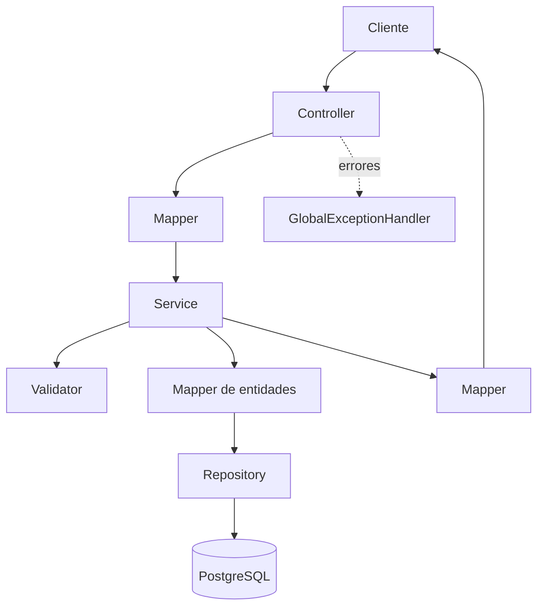
```mermaid
flowchart TD
    C["Cliente"] --> CTRL["Controller"]
    CTRL --> M1["Mapper"]
    M1 --> SVC["Service"]
    SVC --> VAL["Validator"]
    SVC --> ME["Mapper de entidades"]
    ME --> REPO["Repository"]
    REPO --> DB[("PostgreSQL")]
    SVC --> M2["Mapper"]
    M2 --> C
    CTRL -. errores .-> GEH["GlobalExceptionHandler"]
```

---

## Diagrama de clases

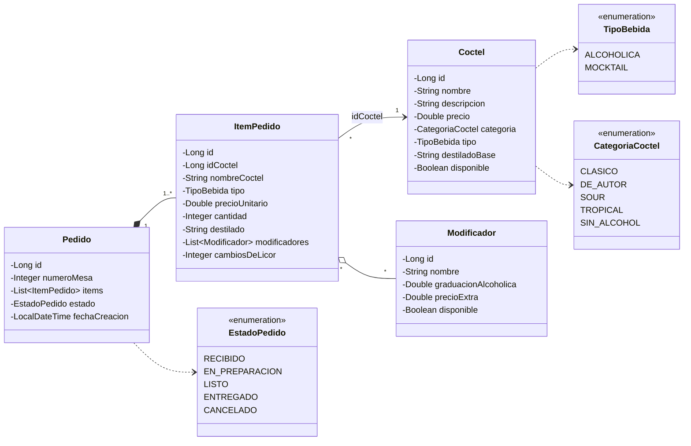
```mermaid
classDiagram
    direction LR

    class Coctel {
        -Long id
        -String nombre
        -String descripcion
        -Double precio
        -CategoriaCoctel categoria
        -TipoBebida tipo
        -String destiladoBase
        -Boolean disponible
    }

    class Modificador {
        -Long id
        -String nombre
        -Double graduacionAlcoholica
        -Double precioExtra
        -Boolean disponible
    }

    class Pedido {
        -Long id
        -Integer numeroMesa
        -List~ItemPedido~ items
        -EstadoPedido estado
        -LocalDateTime fechaCreacion
    }

    class ItemPedido {
        -Long id
        -Long idCoctel
        -String nombreCoctel
        -TipoBebida tipo
        -Double precioUnitario
        -Integer cantidad
        -String destilado
        -List~Modificador~ modificadores
        -Integer cambiosDeLicor
    }

    class TipoBebida {
        <<enumeration>>
        ALCOHOLICA
        MOCKTAIL
    }

    class CategoriaCoctel {
        <<enumeration>>
        CLASICO
        DE_AUTOR
        SOUR
        TROPICAL
        SIN_ALCOHOL
    }

    class EstadoPedido {
        <<enumeration>>
        RECIBIDO
        EN_PREPARACION
        LISTO
        ENTREGADO
        CANCELADO
    }

    Pedido "1" *-- "1..*" ItemPedido
    ItemPedido "*" --> "1" Coctel : idCoctel
    ItemPedido "*" o-- "*" Modificador
    Coctel ..> TipoBebida
    Coctel ..> CategoriaCoctel
    Pedido ..> EstadoPedido
```

---

## Persistencia

Para Blue Velvet se escogió una base de datos **relacional (PostgreSQL)**:

- La información tiene relaciones fijas: una comanda tiene ítems, cada ítem pertenece a un cóctel y puede tener modificadores.
- Las comandas y el inventario necesitan transacciones ACID. Si una comanda falla a la mitad, no debe quedar guardada una parte de ella.
- Las reglas del negocio se apoyan en restricciones de la base de datos: nombres únicos y llaves foráneas entre comandas, ítems y cócteles.
- La estructura de la carta no cambia de forma, por lo que no se necesita el esquema flexible de una base NoSQL.

Cada ítem guarda el nombre y el precio del cóctel al momento del pedido, y la tabla `item_modificador` guarda el precio del modificador. Así, si la carta cambia, las comandas anteriores conservan sus valores.

### Modelo relacional

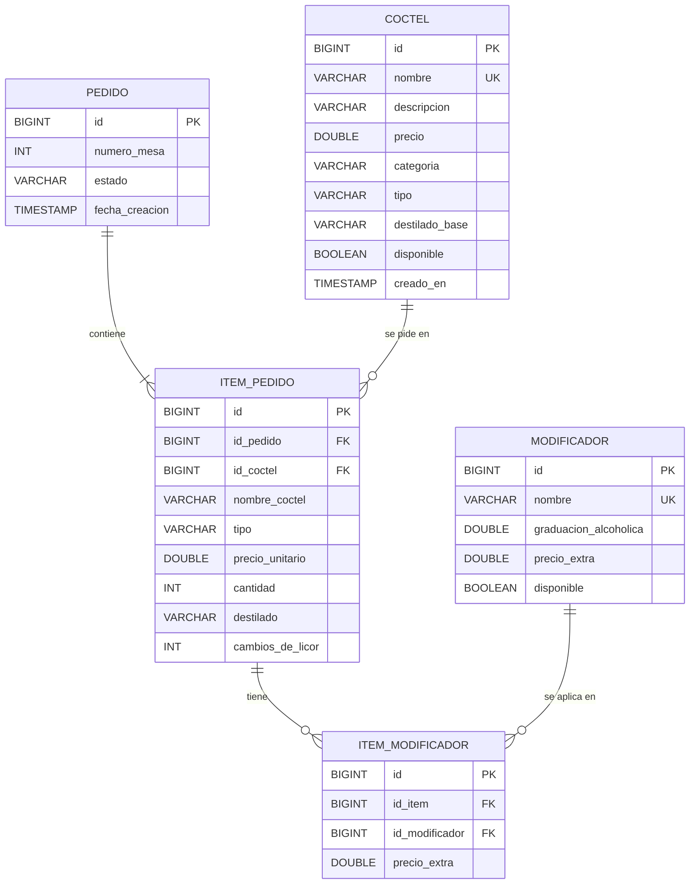
```mermaid
erDiagram
    COCTEL {
        BIGINT id PK
        VARCHAR nombre UK
        VARCHAR descripcion
        DOUBLE precio
        VARCHAR categoria
        VARCHAR tipo
        VARCHAR destilado_base
        BOOLEAN disponible
        TIMESTAMP creado_en
    }
    MODIFICADOR {
        BIGINT id PK
        VARCHAR nombre UK
        DOUBLE graduacion_alcoholica
        DOUBLE precio_extra
        BOOLEAN disponible
    }
    PEDIDO {
        BIGINT id PK
        INT numero_mesa
        VARCHAR estado
        TIMESTAMP fecha_creacion
    }
    ITEM_PEDIDO {
        BIGINT id PK
        BIGINT id_pedido FK
        BIGINT id_coctel FK
        VARCHAR nombre_coctel
        VARCHAR tipo
        DOUBLE precio_unitario
        INT cantidad
        VARCHAR destilado
        INT cambios_de_licor
    }
    ITEM_MODIFICADOR {
        BIGINT id PK
        BIGINT id_item FK
        BIGINT id_modificador FK
        DOUBLE precio_extra
    }
    PEDIDO ||--|{ ITEM_PEDIDO : contiene
    COCTEL ||--o{ ITEM_PEDIDO : "se pide en"
    ITEM_PEDIDO ||--o{ ITEM_MODIFICADOR : tiene
    MODIFICADOR ||--o{ ITEM_MODIFICADOR : "se aplica en"
```

### Configuración de la base de datos

La conexión se configura en `application.properties` con variables de entorno. Si no existen, se usan los valores por defecto:

| Variable | Valor por defecto |
|---|---|
| `DB_URL` | `jdbc:postgresql://localhost:5432/blue_velvet` |
| `DB_USERNAME` | `postgres` |
| `DB_PASSWORD` | `postgres` |

Para crear la base de datos con Docker:

```bash
docker run -d --name blue-velvet-db -e POSTGRES_DB=blue_velvet -e POSTGRES_PASSWORD=postgres -e LANG=C.UTF-8 -e LC_ALL=C.UTF-8 -p 5432:5432 postgres:16
```

Las tablas se crean automáticamente al iniciar la aplicación (`ddl-auto=update`). Las pruebas usan H2 en memoria, por lo que no necesitan PostgreSQL.

---

## Roles

| Rol | Puede hacer | No puede hacer |
|---|---|---|
| Administrador | Administrar cócteles y modificadores, marcar agotados, consultar y cancelar comandas | Crear comandas, cambiar el licor o el estado de una comanda |
| Bartender | Ver el tablero de la barra, cambiar el estado de las comandas y marcar productos agotados | Administrar la carta, crear o cancelar comandas |
| Mesero | Ver la carta, crear comandas, cambiar el licor una vez y cancelar comandas en RECIBIDO | Administrar la carta, marcar agotados y cambiar el estado de las comandas |
| Cliente | Ver la carta, crear su comanda, cambiar su licor una vez y consultar su comanda | Administrar la carta, ver otras comandas o el tablero y cambiar estados |

La tabla completa por rol y la matriz de permisos por endpoint están en [docs/roles-blue-velvet.xlsx](docs/roles-blue-velvet.xlsx).

---

## Funcionalidades

| Funcionalidad | Descripción |
|---|---|
| Gestión de cócteles | Crear, actualizar, consultar, eliminar y cambiar la disponibilidad de los cócteles. |
| Carta digital | Consultar la carta y ver cuáles productos están disponibles o agotados. |
| Modificadores | Consultar y administrar los modificadores de los cócteles. |
| Comandas | Crear pedidos indicando la mesa y los cócteles solicitados. |
| Tablero de la barra | Consultar las comandas activas y cambiar su estado. |
| Cambio de licor | Permitir un solo cambio de destilado antes de la preparación. |

---

## Endpoints

Todas las rutas comienzan con `/api/v1/`.

### Cócteles

| Endpoint | Método | Función |
|---|---|---|
| `/api/v1/cocteles` | GET | Consultar todos los cócteles |
| `/api/v1/cocteles/{id}` | GET | Consultar un cóctel |
| `/api/v1/cocteles` | POST | Crear un cóctel |
| `/api/v1/cocteles/{id}` | PUT | Actualizar un cóctel |
| `/api/v1/cocteles/{id}/disponibilidad` | PATCH | Cambiar disponibilidad |
| `/api/v1/cocteles/{id}` | DELETE | Eliminar un cóctel |

### Menú

| Endpoint | Método | Función |
|---|---|---|
| `/api/v1/menu` | GET | Consultar la carta |
| `/api/v1/menu/disponibles` | GET | Consultar solo los disponibles |
| `/api/v1/menu/{id}` | GET | Consultar el detalle de un cóctel |
| `/api/v1/menu/{id}/modificadores` | GET | Consultar sus modificadores |

### Modificadores

| Endpoint | Método | Función |
|---|---|---|
| `/api/v1/modificadores` | GET | Consultar modificadores |
| `/api/v1/modificadores/{id}` | GET | Consultar un modificador |
| `/api/v1/modificadores` | POST | Crear un modificador |
| `/api/v1/modificadores/{id}/disponibilidad` | PATCH | Cambiar disponibilidad |

### Pedidos

| Endpoint | Método | Función |
|---|---|---|
| `/api/v1/pedidos` | POST | Crear una comanda |
| `/api/v1/pedidos` | GET | Consultar comandas |
| `/api/v1/pedidos/activos` | GET | Consultar las comandas activas |
| `/api/v1/pedidos/{id}` | GET | Consultar una comanda |
| `/api/v1/pedidos/{id}/estado` | PATCH | Cambiar el estado de una comanda |
| `/api/v1/pedidos/{id}/items/{idItem}/destilado` | PATCH | Cambiar el licor de un ítem |
| `/api/v1/pedidos/{id}` | DELETE | Cancelar una comanda |

---

## Manejo de errores

Los errores se devuelven con un formato común.

```json
{
  "status": 422,
  "codigo": "BV-422",
  "mensaje": "El coctel Negroni requiere especificar la marca o tipo exacto de destilado",
  "ruta": "/api/v1/pedidos",
  "timestamp": "2026-09-22T21:15:03.120",
  "detalles": []
}
```

| Código | Uso |
|---|---|
| 400 `BV-400` | Datos de entrada incorrectos |
| 404 `BV-404` | Recurso no encontrado |
| 405 `BV-405` | Método no permitido |
| 409 `BV-409` | Nombre duplicado o cóctel con comandas registradas |
| 422 `BV-422` | Regla de negocio no cumplida |
| 500 `BV-500` | Error inesperado |

---

## Pruebas

Se realizaron pruebas para las diferentes partes del proyecto:

| Parte | Pruebas |
|---|---|
| Servicios | Creación, actualización, eliminación, búsquedas y reglas de pedidos |
| Validadores | Alcohol, Mocktails, cambio de licor y estados |
| Utilidades | Normalización de nombres y etiquetas |
| Mappers | Conversión entre DTOs, dominio y entidades |
| Repositorios | Consultas a la base de datos con H2 |
| Dominio | Totales, subtotales y estados |
| Controladores | Respuestas HTTP y errores |
| Integración | Flujo completo de una comanda y CRUD de un cóctel guardados en base de datos |

---

## Evidencias

### Swagger

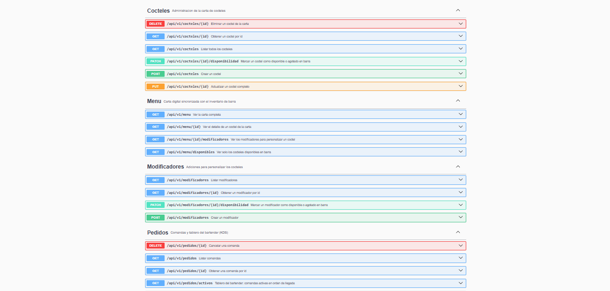

### Ejecución de la aplicación

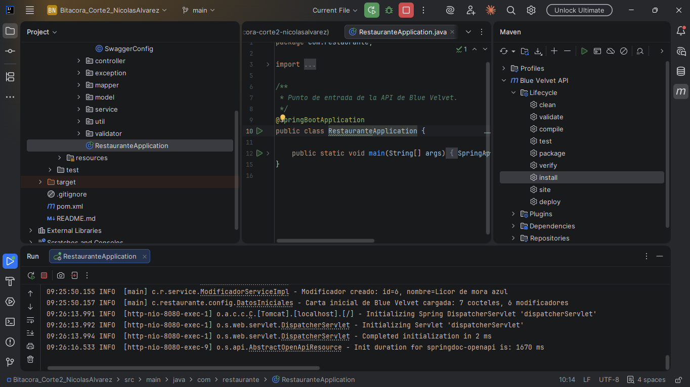

### Pruebas y cobertura

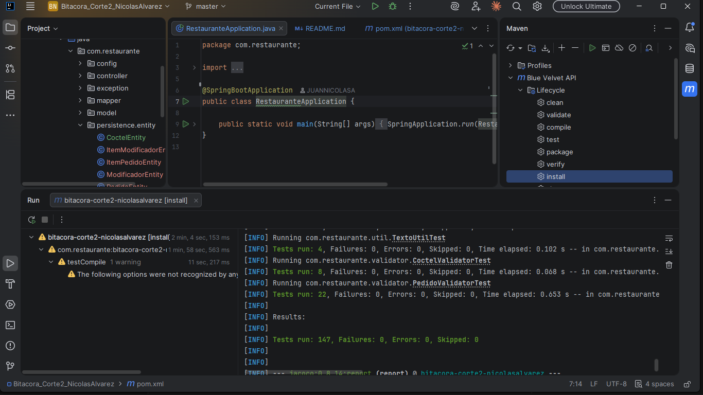

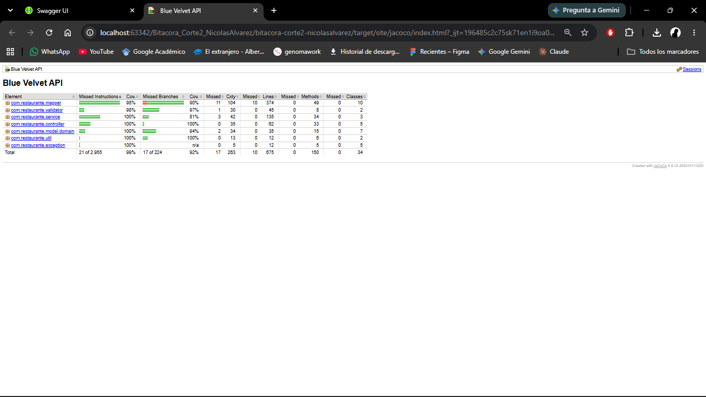

### SonarQube

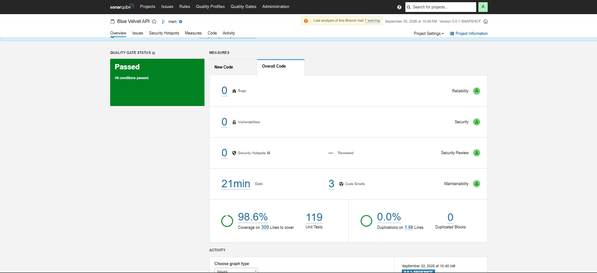

### Persistencia en PostgreSQL

Se probó el CRUD de un cóctel desde Swagger y se revisó el resultado directamente en la base de datos.

**Tablas creadas por Hibernate en PostgreSQL**

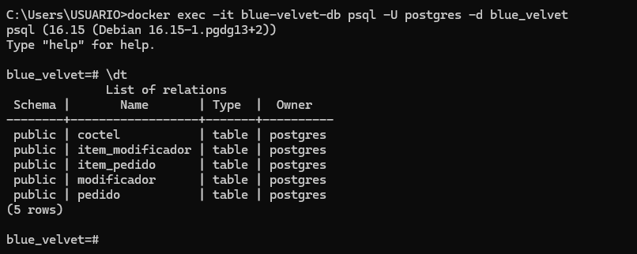

**Crear un cóctel (201)**

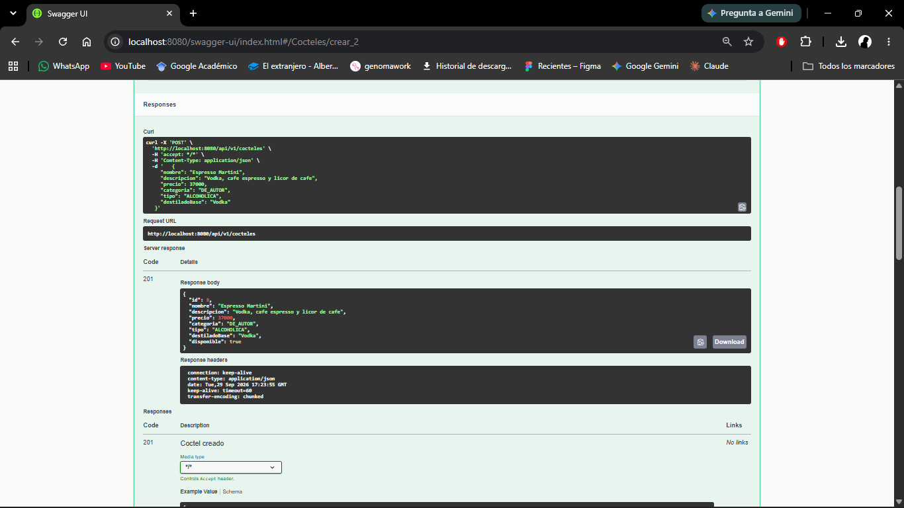

**Consultar el cóctel creado (200)**

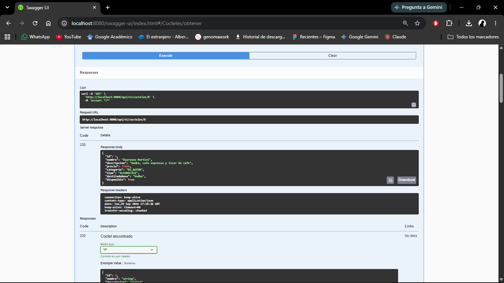

**Registro guardado en la tabla `coctel`**

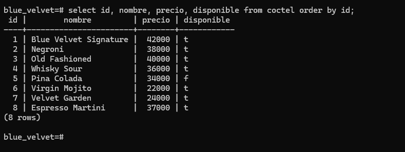

**Eliminar el cóctel (204)**

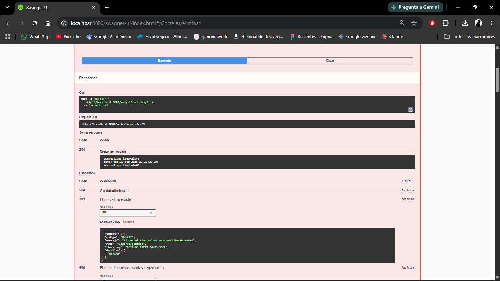

**Los datos se conservan al reiniciar la aplicación**

Al volver a iniciar, la aplicación detecta que la base ya tiene información y no vuelve a cargar la carta inicial. La consulta de cócteles devuelve los mismos registros.

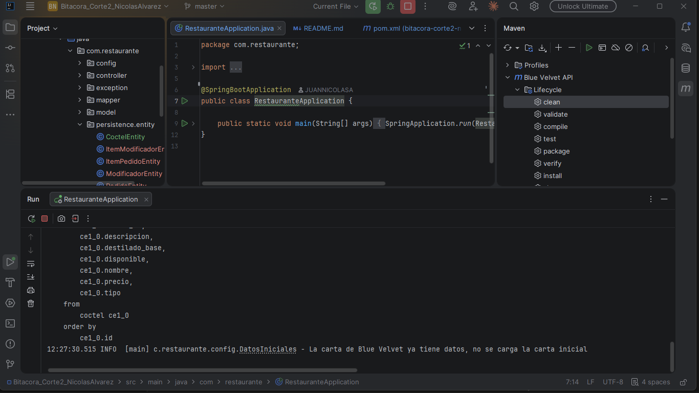

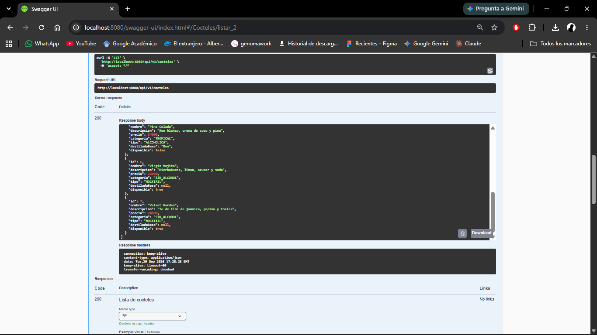

### Pruebas funcionales

| Funcionalidad | Evidencia |
|---|---|
| Crear cóctel |  |
| Carta con productos agotados | 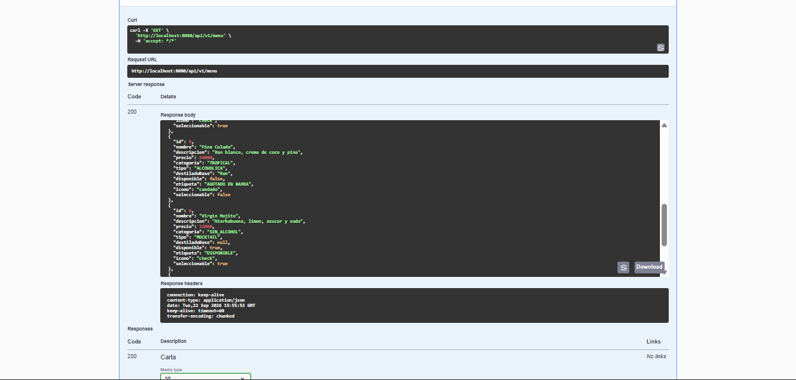 |
| Modificadores bloqueados en Mocktail | 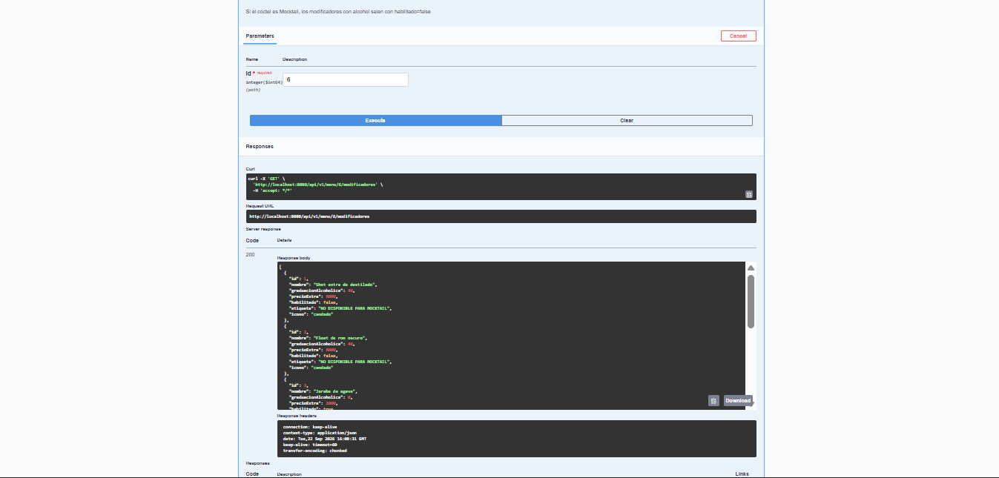 |
| Crear comanda | 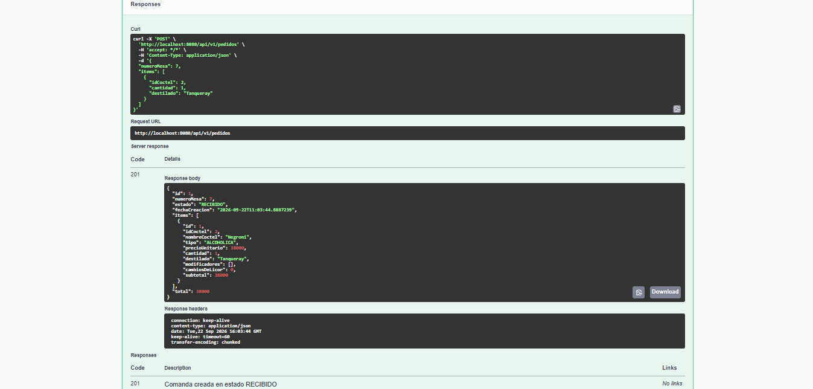 |
| Trazabilidad del alcohol | 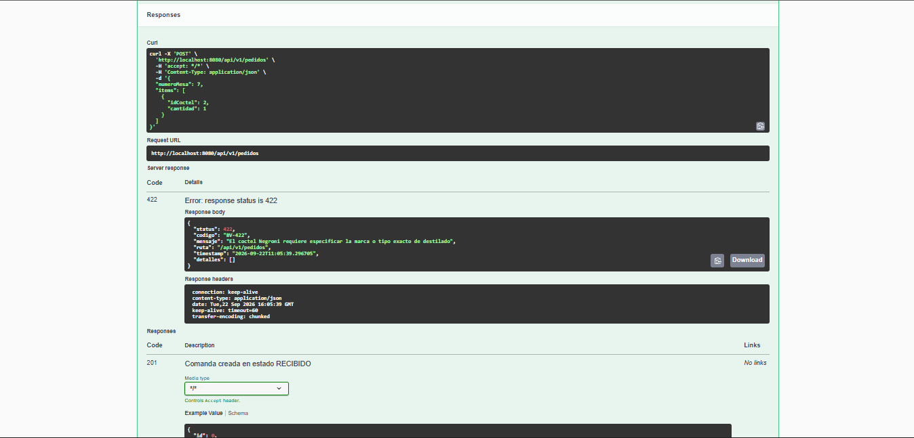 |
| Cambio de estado en el KDS | 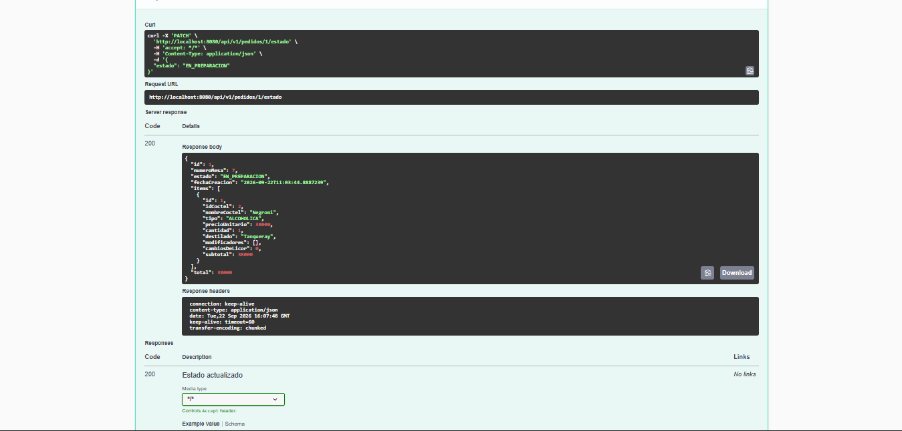 |
| Cambio de licor una sola vez | 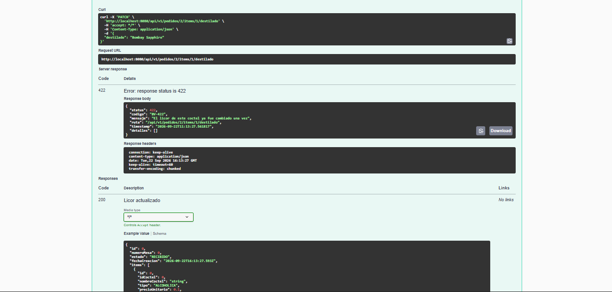 |
| Validación del precio | 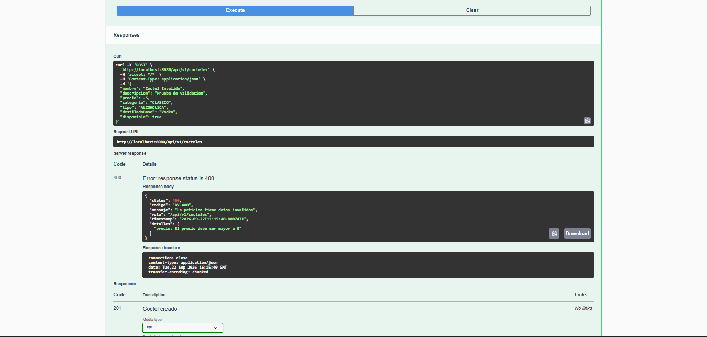 |

---

## Fuera de alcance

- Autenticación y aplicación de los roles en la API.
- Pagos y facturación electrónica.
- Interfaz gráfica.