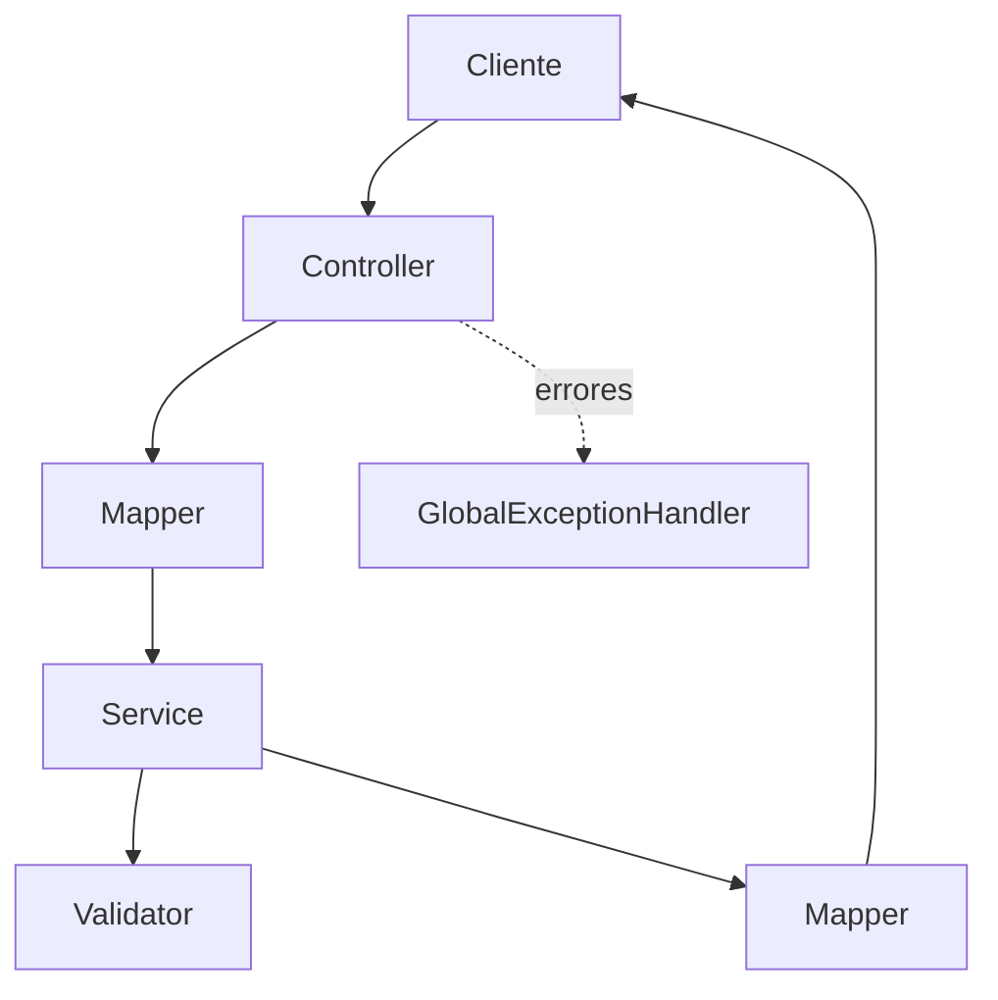
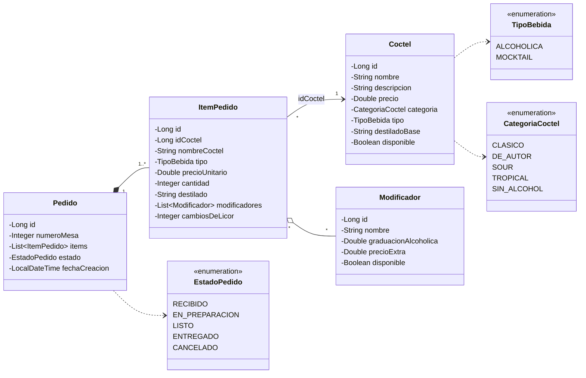

# Blue Velvet - API REST

**Bitácora Corte 2 - DOSW 1**  
**Escuela Colombiana de Ingeniería**  
**Realizado por:** Juan Nicolás Álvarez Muñoz

---

## Descripción

Blue Velvet es una API para una coctelería. El proyecto permite manejar la carta de cócteles, los modificadores y las comandas que llegan a la barra.

En esta versión la información se guarda en memoria. Al iniciar la aplicación se carga una carta de ejemplo con cócteles y modificadores.

### Reglas de negocio

| Regla | Descripción |
|---|---|
| Trazabilidad del alcohol | Los cócteles con alcohol deben indicar la marca o el tipo de destilado cuando se hace una comanda. |
| Cambio de licor | El destilado de un cóctel se puede cambiar una sola vez y antes de que la comanda pase a preparación. |
| Mocktails | Los modificadores que contienen alcohol no se pueden usar en un Mocktail. |
| Disponibilidad | No se pueden pedir cócteles o modificadores que estén agotados. |
| Estados de la comanda | La comanda avanza en este orden: Recibido, En Preparación, Listo y Entregado. |
| Información de agotados | Los productos agotados muestran la etiqueta `AGOTADO EN BARRA`, el icono `candado` y no se pueden seleccionar. |

---

## Herramientas utilizadas

| Herramienta | Uso |
|---|---|
| Java 17 | Desarrollo del proyecto |
| Maven | Construcción del proyecto |
| Spring Boot | Desarrollo de la API |
| Lombok | Reducción de código repetido y logs |
| MapStruct | Conversión entre objetos |
| Bean Validation | Validación de datos de entrada |
| Swagger UI | Consulta y prueba de los endpoints |
| JUnit 5, Mockito y MockMvc | Pruebas |
| JaCoCo | Cobertura de pruebas |
| SonarQube | Revisión del código |

---

## Estructura del proyecto

```text
src/main/java/com/restaurante
├── RestauranteApplication.java
├── config/
├── controller/
├── service/
├── model/
│   ├── domain/
│   └── dto/
│       ├── request/
│       └── response/
├── mapper/
├── validator/
├── exception/
└── util/

src/test/java/com/restaurante
├── controller/
├── service/
├── mapper/
├── validator/
├── util/
├── model/domain/
└── integration/
```

Las principales partes del proyecto son:

- `controller`: recibe las solicitudes.
- `service`: contiene las operaciones de la aplicación.
- `model`: contiene las clases y datos usados por el proyecto.
- `mapper`: realiza las conversiones entre objetos.
- `validator`: contiene las reglas del negocio.
- `exception`: maneja los errores.
- `util`: contiene funciones de apoyo.

---

## Arquitectura



---

## Diagrama de clases



---

## Funcionalidades

| Funcionalidad | Descripción |
|---|---|
| Gestión de cócteles | Crear, actualizar, consultar, eliminar y cambiar la disponibilidad de los cócteles. |
| Carta digital | Consultar la carta y ver cuáles productos están disponibles o agotados. |
| Modificadores | Consultar y administrar los modificadores de los cócteles. |
| Comandas | Crear pedidos indicando la mesa y los cócteles solicitados. |
| Tablero de la barra | Consultar las comandas activas y cambiar su estado. |
| Cambio de licor | Permitir un solo cambio de destilado antes de la preparación. |

---

## Endpoints

Todas las rutas comienzan con `/api/v1/`.

### Cócteles

| Endpoint | Método | Función |
|---|---|---|
| `/api/v1/cocteles` | GET | Consultar todos los cócteles |
| `/api/v1/cocteles/{id}` | GET | Consultar un cóctel |
| `/api/v1/cocteles` | POST | Crear un cóctel |
| `/api/v1/cocteles/{id}` | PUT | Actualizar un cóctel |
| `/api/v1/cocteles/{id}/disponibilidad` | PATCH | Cambiar disponibilidad |
| `/api/v1/cocteles/{id}` | DELETE | Eliminar un cóctel |

### Menú

| Endpoint | Método | Función |
|---|---|---|
| `/api/v1/menu` | GET | Consultar la carta |
| `/api/v1/menu/disponibles` | GET | Consultar solo los disponibles |
| `/api/v1/menu/{id}` | GET | Consultar el detalle de un cóctel |
| `/api/v1/menu/{id}/modificadores` | GET | Consultar sus modificadores |

### Modificadores

| Endpoint | Método | Función |
|---|---|---|
| `/api/v1/modificadores` | GET | Consultar modificadores |
| `/api/v1/modificadores/{id}` | GET | Consultar un modificador |
| `/api/v1/modificadores` | POST | Crear un modificador |
| `/api/v1/modificadores/{id}/disponibilidad` | PATCH | Cambiar disponibilidad |

### Pedidos

| Endpoint | Método | Función |
|---|---|---|
| `/api/v1/pedidos` | POST | Crear una comanda |
| `/api/v1/pedidos` | GET | Consultar comandas |
| `/api/v1/pedidos/activos` | GET | Consultar las comandas activas |
| `/api/v1/pedidos/{id}` | GET | Consultar una comanda |
| `/api/v1/pedidos/{id}/estado` | PATCH | Cambiar el estado de una comanda |
| `/api/v1/pedidos/{id}/items/{idItem}/destilado` | PATCH | Cambiar el licor de un ítem |
| `/api/v1/pedidos/{id}` | DELETE | Cancelar una comanda |

---

## Manejo de errores

Los errores se devuelven con un formato común.

```json
{
  "status": 422,
  "codigo": "BV-422",
  "mensaje": "El coctel Negroni requiere especificar la marca o tipo exacto de destilado",
  "ruta": "/api/v1/pedidos",
  "timestamp": "2026-09-22T21:15:03.120",
  "detalles": []
}
```

| Código | Uso |
|---|---|
| 400 `BV-400` | Datos de entrada incorrectos |
| 404 `BV-404` | Recurso no encontrado |
| 405 `BV-405` | Método no permitido |
| 409 `BV-409` | Nombre duplicado |
| 422 `BV-422` | Regla de negocio no cumplida |
| 500 `BV-500` | Error inesperado |

---

## Pruebas

Se realizaron pruebas para las diferentes partes del proyecto:

| Parte | Pruebas |
|---|---|
| Servicios | Creación, actualización, eliminación, búsquedas y reglas de pedidos |
| Validadores | Alcohol, Mocktails, cambio de licor y estados |
| Utilidades | Normalización de nombres y etiquetas |
| Mappers | Conversión de los datos |
| Dominio | Totales, subtotales y estados |
| Controladores | Respuestas HTTP y errores |
| Integración | Inicio de la aplicación y creación de una comanda |

---

## Evidencias

### Swagger


### Ejecución de la aplicación


### Pruebas y cobertura


### SonarQube


### Pruebas funcionales

| Funcionalidad | Evidencia |
|---|---|
| Crear cóctel |  |
| Carta con productos agotados |  |
| Modificadores bloqueados en Mocktail |  |
| Crear comanda |  |
| Trazabilidad del alcohol |  |
| Cambio de estado en el KDS |  |
| Cambio de licor una sola vez |  |
| Validación del precio |  |

---

## Fuera de alcance

- Base de datos y persistencia.
- Pagos y facturación electrónica.
- Interfaz gráfica.