# Blue Velvet - API REST

**Bitácora Corte 2 - DOSW 1**  
**Escuela Colombiana de Ingeniería**  
**Realizado por:** Juan Nicolás Álvarez Muñoz

---

## Índice

1. [Descripción](#descripción)
2. [Herramientas utilizadas](#herramientas-utilizadas)
3. [Estructura del proyecto](#estructura-del-proyecto)
4. [Arquitectura](#arquitectura)
5. [Diagrama de clases](#diagrama-de-clases)
6. [Persistencia](#persistencia)
7. [Seguridad](#seguridad)
8. [Docker](#docker)
9. [CI/CD y despliegue](#cicd-y-despliegue)
10. [Funcionalidades](#funcionalidades)
11. [Endpoints](#endpoints)
12. [Manejo de errores](#manejo-de-errores)
13. [Pruebas](#pruebas)
14. [Evidencias](#evidencias)
15. [Fuera de alcance](#fuera-de-alcance)

---

## Descripción

Blue Velvet es una API para una coctelería. El proyecto permite manejar la carta de cócteles, los modificadores y las comandas que llegan a la barra.

La información principal se guarda en PostgreSQL y el historial de eventos de las comandas se guarda en MongoDB. El acceso a la API está protegido con Spring Security: cada usuario inicia sesión, recibe un token JWT y solo puede usar los endpoints que corresponden a su rol.

La aplicación se empaqueta en una imagen Docker y se despliega en Azure por medio de pipelines de GitHub Actions, con un ambiente de QA y uno de producción.

### Reglas de negocio

| Regla | Descripción |
|---|---|
| Trazabilidad del alcohol | Los cócteles con alcohol deben indicar la marca o el tipo de destilado cuando se hace una comanda. |
| Cambio de licor | El destilado de un cóctel se puede cambiar una sola vez y antes de que la comanda pase a preparación. |
| Mocktails | Los modificadores que contienen alcohol no se pueden usar en un Mocktail. |
| Disponibilidad | No se pueden pedir cócteles o modificadores que estén agotados. |
| Estados de la comanda | La comanda avanza en este orden: Recibido, En Preparación, Listo y Entregado. |
| Información de agotados | Los productos agotados muestran la etiqueta `AGOTADO EN BARRA`, el icono `candado` y no se pueden seleccionar. |
| Comandas del cliente | Un cliente solo puede consultar y modificar las comandas que él mismo creó. |

---

## Herramientas utilizadas

| Herramienta | Uso |
|---|---|
| Java 17 | Desarrollo del proyecto |
| Maven | Construcción del proyecto |
| Spring Boot | Desarrollo de la API |
| Spring Security | Autenticación y autorización |
| JJWT | Generación y validación de tokens JWT |
| Lombok | Reducción de código repetido y logs |
| MapStruct | Conversión entre objetos |
| Bean Validation | Validación de datos de entrada |
| Spring Data JPA | Acceso a PostgreSQL |
| Spring Data MongoDB | Acceso a MongoDB |
| PostgreSQL | Base de datos relacional |
| MongoDB | Base de datos no relacional para el historial de eventos |
| H2 | Base de datos en memoria para las pruebas |
| Swagger UI | Consulta y prueba de los endpoints |
| JUnit 5, Mockito y MockMvc | Pruebas |
| JaCoCo | Cobertura de pruebas |
| SonarQube | Revisión del código |
| Docker y Docker Compose | Empaquetado y ejecución de la aplicación |
| GitHub Actions | Integración y despliegue continuo |
| Azure | App Service, Azure Database for PostgreSQL y Azure Cosmos DB for MongoDB |

---

## Estructura del proyecto

```text
src/main/java/com/restaurante
├── RestauranteApplication.java
├── config/
├── controller/
├── service/
├── security/
├── model/
│   ├── domain/
│   └── dto/
│       ├── request/
│       └── response/
├── persistence/
│   ├── entity/
│   └── document/
├── repository/
├── mapper/
├── validator/
├── exception/
└── util/
```

- `controller`: recibe las solicitudes.
- `service`: contiene las operaciones de la aplicación.
- `security`: contiene el filtro JWT, la carga de usuarios y el manejo de errores de seguridad.
- `config`: contiene la configuración de seguridad, CORS, Swagger y los datos iniciales.
- `model`: contiene las clases y datos usados por el proyecto.
- `persistence/entity`: contiene las entidades de las tablas de PostgreSQL.
- `persistence/document`: contiene los documentos de las colecciones de MongoDB.
- `repository`: contiene los repositorios de Spring Data JPA y Spring Data MongoDB.
- `mapper`: realiza las conversiones entre DTOs, dominio, entidades y documentos.
- `validator`: contiene las reglas del negocio.
- `exception`: maneja los errores.
- `util`: contiene funciones de apoyo.

---

## Arquitectura

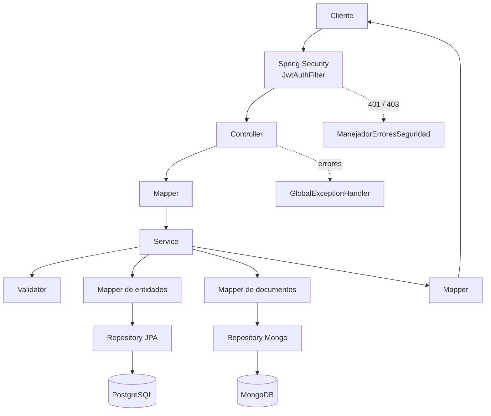
```mermaid
flowchart TD
    C["Cliente"] --> SEC["Spring Security<br/>JwtAuthFilter"]
    SEC --> CTRL["Controller"]
    CTRL --> M1["Mapper"]
    M1 --> SVC["Service"]
    SVC --> VAL["Validator"]
    SVC --> ME["Mapper de entidades"]
    SVC --> MD["Mapper de documentos"]
    ME --> REPO["Repository JPA"]
    MD --> MREPO["Repository Mongo"]
    REPO --> DB[("PostgreSQL")]
    MREPO --> MDB[("MongoDB")]
    SVC --> M2["Mapper"]
    M2 --> C
    CTRL -. errores .-> GEH["GlobalExceptionHandler"]
    SEC -. 401 / 403 .-> MES["ManejadorErroresSeguridad"]
```

El diagrama muestra el recorrido de una petición. Primero pasa por Spring Security, donde el filtro `JwtAuthFilter` revisa el token y establece el usuario y su rol. Si la petición no tiene un token válido o el rol no tiene permiso, `ManejadorErroresSeguridad` responde 401 o 403. Si la petición es válida, llega al controller, que convierte el DTO a dominio y llama al service. El service aplica las reglas con los validators y usa los mappers para guardar la información: las tablas en PostgreSQL por medio de los repositorios JPA y los eventos en MongoDB por medio del repositorio Mongo. Los errores del negocio se responden desde `GlobalExceptionHandler`.

---

## Diagrama de clases

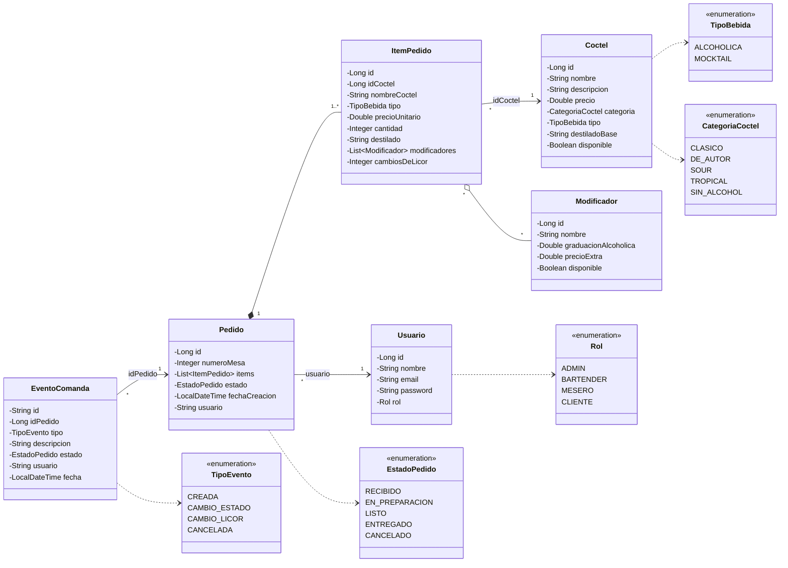
```mermaid
classDiagram
    direction LR

    class Coctel {
        -Long id
        -String nombre
        -String descripcion
        -Double precio
        -CategoriaCoctel categoria
        -TipoBebida tipo
        -String destiladoBase
        -Boolean disponible
    }

    class Modificador {
        -Long id
        -String nombre
        -Double graduacionAlcoholica
        -Double precioExtra
        -Boolean disponible
    }

    class Pedido {
        -Long id
        -Integer numeroMesa
        -List~ItemPedido~ items
        -EstadoPedido estado
        -LocalDateTime fechaCreacion
        -String usuario
    }

    class ItemPedido {
        -Long id
        -Long idCoctel
        -String nombreCoctel
        -TipoBebida tipo
        -Double precioUnitario
        -Integer cantidad
        -String destilado
        -List~Modificador~ modificadores
        -Integer cambiosDeLicor
    }

    class Usuario {
        -Long id
        -String nombre
        -String email
        -String password
        -Rol rol
    }

    class EventoComanda {
        -String id
        -Long idPedido
        -TipoEvento tipo
        -String descripcion
        -EstadoPedido estado
        -String usuario
        -LocalDateTime fecha
    }

    class TipoBebida {
        <<enumeration>>
        ALCOHOLICA
        MOCKTAIL
    }

    class CategoriaCoctel {
        <<enumeration>>
        CLASICO
        DE_AUTOR
        SOUR
        TROPICAL
        SIN_ALCOHOL
    }

    class EstadoPedido {
        <<enumeration>>
        RECIBIDO
        EN_PREPARACION
        LISTO
        ENTREGADO
        CANCELADO
    }

    class Rol {
        <<enumeration>>
        ADMIN
        BARTENDER
        MESERO
        CLIENTE
    }

    class TipoEvento {
        <<enumeration>>
        CREADA
        CAMBIO_ESTADO
        CAMBIO_LICOR
        CANCELADA
    }

    Pedido "1" *-- "1..*" ItemPedido
    ItemPedido "*" --> "1" Coctel : idCoctel
    ItemPedido "*" o-- "*" Modificador
    Pedido "*" --> "1" Usuario : usuario
    EventoComanda "*" --> "1" Pedido : idPedido
    Coctel ..> TipoBebida
    Coctel ..> CategoriaCoctel
    Pedido ..> EstadoPedido
    Usuario ..> Rol
    EventoComanda ..> TipoEvento
```

El diagrama muestra las clases del dominio. Una comanda (`Pedido`) está compuesta por uno o varios `ItemPedido`; cada ítem apunta a un `Coctel` y puede tener varios `Modificador`. La comanda guarda el correo del `Usuario` que la creó, lo que permite que un cliente solo vea sus propias comandas. Cada `Usuario` tiene un `Rol`, que define lo que puede hacer en la API. `EventoComanda` representa un registro del historial de una comanda (creación, cambio de estado, cambio de licor o cancelación) y se relaciona con la comanda por su id. Los enumerados fijan los valores permitidos de tipo, categoría, estado, rol y tipo de evento.

---

## Persistencia

Blue Velvet usa una persistencia **híbrida**:

| Base de datos | Información | Motivo |
|---|---|---|
| PostgreSQL (relacional) | Cócteles, modificadores, comandas, ítems y usuarios | La información tiene relaciones fijas, necesita transacciones ACID y restricciones de integridad. |
| MongoDB (no relacional) | Historial de eventos de las comandas | Es un registro que solo se agrega y se consulta, no necesita relaciones ni transacciones y puede crecer sin cambiar el esquema de las tablas. |

En PostgreSQL:

- La información tiene relaciones fijas: una comanda tiene ítems, cada ítem pertenece a un cóctel y puede tener modificadores.
- Las comandas y el inventario necesitan transacciones ACID. Si una comanda falla a la mitad, no debe quedar guardada una parte de ella.
- Las reglas del negocio se apoyan en restricciones de la base de datos: nombres y correos únicos y llaves foráneas entre comandas, ítems y cócteles.

Cada ítem guarda el nombre y el precio del cóctel al momento del pedido, y la tabla `item_modificador` guarda el precio del modificador. Así, si la carta cambia, las comandas anteriores conservan sus valores.

En MongoDB, cada vez que una comanda se crea, cambia de estado, cambia de licor o se cancela, se guarda un documento en la colección `eventos_comanda` con el usuario que hizo la acción y la fecha. El administrador consulta este historial en `GET /api/v1/eventos`.

### Modelo relacional

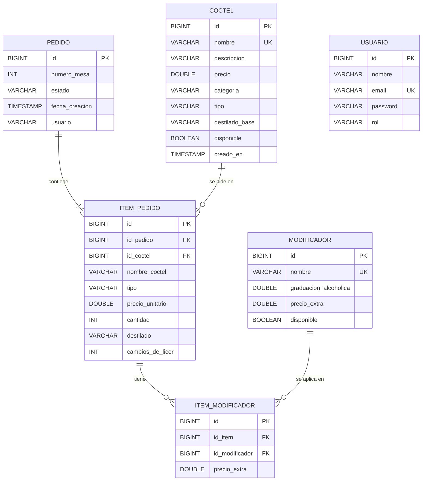
```mermaid
erDiagram
    COCTEL {
        BIGINT id PK
        VARCHAR nombre UK
        VARCHAR descripcion
        DOUBLE precio
        VARCHAR categoria
        VARCHAR tipo
        VARCHAR destilado_base
        BOOLEAN disponible
        TIMESTAMP creado_en
    }
    MODIFICADOR {
        BIGINT id PK
        VARCHAR nombre UK
        DOUBLE graduacion_alcoholica
        DOUBLE precio_extra
        BOOLEAN disponible
    }
    PEDIDO {
        BIGINT id PK
        INT numero_mesa
        VARCHAR estado
        TIMESTAMP fecha_creacion
        VARCHAR usuario
    }
    ITEM_PEDIDO {
        BIGINT id PK
        BIGINT id_pedido FK
        BIGINT id_coctel FK
        VARCHAR nombre_coctel
        VARCHAR tipo
        DOUBLE precio_unitario
        INT cantidad
        VARCHAR destilado
        INT cambios_de_licor
    }
    ITEM_MODIFICADOR {
        BIGINT id PK
        BIGINT id_item FK
        BIGINT id_modificador FK
        DOUBLE precio_extra
    }
    USUARIO {
        BIGINT id PK
        VARCHAR nombre
        VARCHAR email UK
        VARCHAR password
        VARCHAR rol
    }
    PEDIDO ||--|{ ITEM_PEDIDO : contiene
    COCTEL ||--o{ ITEM_PEDIDO : "se pide en"
    ITEM_PEDIDO ||--o{ ITEM_MODIFICADOR : tiene
    MODIFICADOR ||--o{ ITEM_MODIFICADOR : "se aplica en"
```

El modelo muestra las seis tablas de PostgreSQL. `pedido` se relaciona con `item_pedido` (una comanda tiene uno o más ítems) y cada ítem apunta a un `coctel`. La relación entre ítems y modificadores se resuelve con la tabla intermedia `item_modificador`, que además guarda el precio del modificador en el momento del pedido. La tabla `usuario` guarda las cuentas con la contraseña cifrada con BCrypt y el rol; la columna `usuario` de `pedido` guarda el correo de quien creó la comanda.

### Modelo de documentos

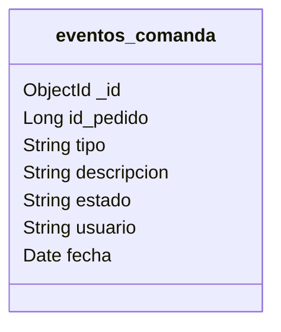
```mermaid
classDiagram
    class eventos_comanda {
        ObjectId _id
        Long id_pedido
        String tipo
        String descripcion
        String estado
        String usuario
        Date fecha
    }
```

Ejemplo de un documento:

```json
{
  "_id": "6aca524b11764517afeead09",
  "id_pedido": 1,
  "tipo": "CAMBIO_ESTADO",
  "descripcion": "Estado cambiado de RECIBIDO a EN_PREPARACION",
  "estado": "EN_PREPARACION",
  "usuario": "bartender@bluevelvet.com",
  "fecha": "2026-10-10T14:57:15.860Z"
}
```

La colección `eventos_comanda` guarda un documento por cada acción sobre una comanda. El campo `id_pedido` enlaza el evento con la comanda de PostgreSQL. Los campos `id_pedido` y `fecha` tienen índice, porque los eventos se filtran por comanda y se ordenan por fecha.

### Configuración de las bases de datos

La conexión se configura con variables de entorno. Si no existen, se usan los valores por defecto:

| Variable | Valor por defecto |
|---|---|
| `DB_URL` | `jdbc:postgresql://localhost:5432/blue_velvet` |
| `DB_USERNAME` | `postgres` |
| `DB_PASSWORD` | `postgres` |
| `MONGO_URI` | `mongodb://localhost:27017/blue_velvet` |

Las tablas se crean automáticamente al iniciar la aplicación (`ddl-auto=update`). Las pruebas usan H2 en memoria y simulan el repositorio de MongoDB, por lo que no necesitan ninguna base de datos instalada.

---

## Seguridad

La seguridad se implementó con Spring Security siguiendo tres preguntas: quién es el usuario (autenticación), qué puede hacer (autorización) y si la información llega sin alteraciones (integridad).

### Roles

| Rol | Puede hacer | No puede hacer |
|---|---|---|
| Administrador (`ADMIN`) | Administrar cócteles y modificadores, marcar agotados, consultar y cancelar comandas, ver el historial de eventos | Crear comandas, cambiar el licor o el estado de una comanda |
| Bartender (`BARTENDER`) | Ver el tablero de la barra, cambiar el estado de las comandas y marcar productos agotados | Administrar la carta, crear o cancelar comandas |
| Mesero (`MESERO`) | Ver la carta, crear comandas, cambiar el licor una vez y cancelar comandas en RECIBIDO | Administrar la carta, marcar agotados y cambiar el estado de las comandas |
| Cliente (`CLIENTE`) | Ver la carta, crear su comanda, cambiar su licor una vez y consultar su comanda | Administrar la carta, ver otras comandas o el tablero y cambiar estados |

La tabla completa por rol está en [docs/roles-blue-velvet.xlsx](docs/roles-blue-velvet.xlsx).

### Permisos por endpoint

| Endpoint | Método | ¿Quién puede? | Regla en Spring |
|---|---|---|---|
| `/api/v1/auth/login` | POST | Todos (público) | `permitAll()` |
| `/api/v1/auth/registro` | POST | Todos (público) | `permitAll()` |
| `/api/v1/auth/me` | GET | Cualquier usuario autenticado | `authenticated()` |
| `/api/v1/menu/**` | GET | Todos (público) | `permitAll()` |
| `/api/v1/cocteles` y `/{id}` | GET | Administrador y bartender | `hasAnyRole('ADMIN','BARTENDER')` |
| `/api/v1/cocteles` | POST | Administrador | `hasRole('ADMIN')` |
| `/api/v1/cocteles/{id}` | PUT | Administrador | `hasRole('ADMIN')` |
| `/api/v1/cocteles/{id}` | DELETE | Administrador | `hasRole('ADMIN')` |
| `/api/v1/cocteles/{id}/disponibilidad` | PATCH | Administrador y bartender | `hasAnyRole('ADMIN','BARTENDER')` |
| `/api/v1/modificadores` y `/{id}` | GET | Administrador, bartender y mesero | `hasAnyRole('ADMIN','BARTENDER','MESERO')` |
| `/api/v1/modificadores` | POST | Administrador | `hasRole('ADMIN')` |
| `/api/v1/modificadores/{id}/disponibilidad` | PATCH | Administrador y bartender | `hasAnyRole('ADMIN','BARTENDER')` |
| `/api/v1/pedidos` | POST | Mesero y cliente | `hasAnyRole('MESERO','CLIENTE')` |
| `/api/v1/pedidos` | GET | Administrador, bartender y mesero | `hasAnyRole('ADMIN','BARTENDER','MESERO')` |
| `/api/v1/pedidos/{id}` | GET | Todos los roles (el cliente solo la suya) | `hasAnyRole(...)` + validación del dueño |
| `/api/v1/pedidos/activos` | GET | Administrador y bartender | `hasAnyRole('ADMIN','BARTENDER')` |
| `/api/v1/pedidos/{id}/estado` | PATCH | Bartender | `hasRole('BARTENDER')` |
| `/api/v1/pedidos/{id}/items/{idItem}/destilado` | PATCH | Mesero y cliente (el cliente solo la suya) | `hasAnyRole('MESERO','CLIENTE')` + validación del dueño |
| `/api/v1/pedidos/{id}` | DELETE | Administrador y mesero | `hasAnyRole('ADMIN','MESERO')` |
| `/api/v1/eventos` | GET | Administrador | `hasRole('ADMIN')` |

Las rutas públicas se definen en `SecurityConfig` y las reglas por rol se definen con `@PreAuthorize` en cada método de los controllers.

### Autenticación

Se implementaron tres formas de autenticación:

| Mecanismo | Uso en el proyecto |
|---|---|
| JWT | Es el mecanismo principal. El usuario inicia sesión en `POST /api/v1/auth/login` y recibe un token firmado con HMAC-SHA que dura una hora. El token lleva el correo y el rol, y se envía en cada petición en el encabezado `Authorization: Bearer <token>`. |
| HTTP Basic | Se puede enviar el correo y la contraseña en cada petición. Solo debe usarse sobre HTTPS, porque Base64 no cifra los datos. |
| OAuth2 con Google | Se activa con el perfil `oauth2` y las variables `GOOGLE_CLIENT_ID` y `GOOGLE_CLIENT_SECRET`. Al ingresar por `/oauth2/authorization/google`, el usuario se crea como cliente si no existe y la API devuelve su propio token JWT. |

Las contraseñas se guardan cifradas con BCrypt. Al iniciar, la aplicación crea un usuario por rol (`admin@bluevelvet.com`, `bartender@bluevelvet.com`, `mesero@bluevelvet.com` y `cliente@bluevelvet.com`) con la contraseña definida en la variable `USUARIOS_PASSWORD`. Los clientes nuevos se registran en `POST /api/v1/auth/registro`; la contraseña debe tener entre 8 y 64 caracteres, con mayúscula, minúscula, número y carácter especial.

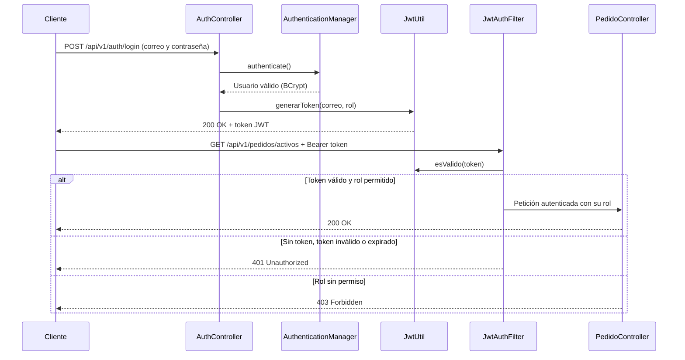
```mermaid
sequenceDiagram
    participant C as Cliente
    participant A as AuthController
    participant M as AuthenticationManager
    participant J as JwtUtil
    participant F as JwtAuthFilter
    participant P as PedidoController

    C->>A: POST /api/v1/auth/login (correo y contraseña)
    A->>M: authenticate()
    M-->>A: Usuario válido (BCrypt)
    A->>J: generarToken(correo, rol)
    J-->>C: 200 OK + token JWT
    C->>F: GET /api/v1/pedidos/activos + Bearer token
    F->>J: esValido(token)
    alt Token válido y rol permitido
        F->>P: Petición autenticada con su rol
        P-->>C: 200 OK
    else Sin token, token inválido o expirado
        F-->>C: 401 Unauthorized
    else Rol sin permiso
        P-->>C: 403 Forbidden
    end
```

El diagrama de secuencia muestra el flujo con JWT. En el login, `AuthenticationManager` compara la contraseña con el hash BCrypt guardado y, si es correcta, `JwtUtil` genera el token. En las siguientes peticiones, `JwtAuthFilter` valida la firma y la fecha de expiración del token; si es válido, toma el correo y el rol del token y deja la petición autenticada. Luego Spring Security revisa el rol con `@PreAuthorize`: si no tiene permiso responde 403 y si no hay un token válido responde 401.

Para evitar ataques de fuerza bruta, después de 5 intentos fallidos el login de esa cuenta se bloquea durante 15 minutos (429). Los inicios de sesión fallidos, los accesos sin autenticación, los accesos denegados y los tokens rechazados quedan registrados en los logs.

### Integridad, SSL, CORS y cabeceras

| Tema | Implementación |
|---|---|
| Integridad del token | El JWT va firmado con una clave de al menos 256 bits. Si alguien cambia el contenido, la firma deja de coincidir y la API responde 401. |
| SSL / HTTPS | Con el perfil `ssl`, la API corre en `https://localhost:8443` con un certificado autofirmado (`keytool`, formato PKCS12). El certificado y su contraseña no se suben al repositorio. En Azure, App Service publica la API por HTTPS. |
| CORS | `CorsConfig` solo permite los orígenes definidos en la variable `CORS_ORIGENES` (por defecto `http://localhost:3000` y `http://localhost:5173`), con los métodos y encabezados que usa la API. |
| CSRF | Está desactivado porque la API no usa sesiones ni cookies: es stateless y el token se envía de forma explícita en cada petición. |
| XSS y clickjacking | La API envía `Content-Security-Policy`, `X-Frame-Options: DENY`, `X-Content-Type-Options: nosniff` y `X-XSS-Protection: 1; mode=block`. |

### Checklist OWASP Top 10

| Riesgo | ¿Aplica? | Cómo se mitigó |
|---|---|---|
| A1 Broken Access Control | Sí | Reglas por rol en cada endpoint con `@PreAuthorize`; el cliente solo accede a sus propias comandas. Un cliente que intenta crear un cóctel recibe 403. |
| A2 Cryptographic Failures | Sí | Contraseñas con BCrypt, JWT firmado con clave de 256 bits o más, HTTPS con el perfil `ssl` y en Azure. |
| A3 Injection | Sí | Solo se usan métodos derivados de Spring Data y `@Query` con parámetros nombrados, tanto en JPA como en MongoDB. No se concatenan consultas. |
| A4 Insecure Design | Sí | Los DTO de respuesta no exponen contraseñas ni datos internos; el registro siempre crea clientes y no permite elegir el rol. |
| A5 Security Misconfiguration | Sí | Los errores 500 no muestran el stack trace, las credenciales se leen de variables de entorno y CORS solo acepta orígenes configurados. |
| A6 Vulnerable and Outdated Components | Sí | Dependencias de Maven Central en versiones estables recientes (Spring Boot 3.5.6, JJWT 0.12.6). |
| A7 Identification and Authentication Failures | Sí | Tokens con expiración de una hora, validación de complejidad de la contraseña, bloqueo tras 5 intentos fallidos y respuesta 401 (no 500) con tokens vencidos. |
| A8 Software and Data Integrity Failures | Sí | La firma del JWT se verifica en cada petición y las dependencias vienen de Maven Central. |
| A9 Security Logging and Monitoring Failures | Sí | Se registran en los logs los logins fallidos, los bloqueos, los tokens rechazados y los accesos 401 y 403. |
| A10 Server-Side Request Forgery | No | La API no recibe URLs como parámetros ni consulta recursos externos a partir de datos del usuario. |

### Evidencias de seguridad

**Login exitoso en Swagger (200 con el token JWT)**

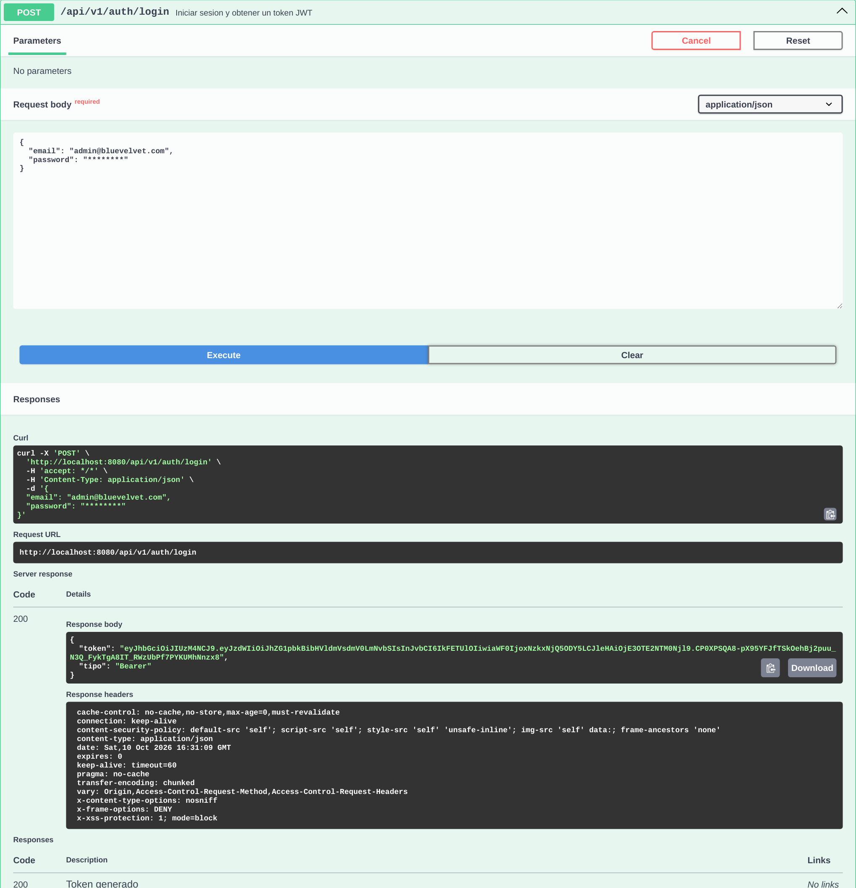

**Botón Authorize con el token ingresado**

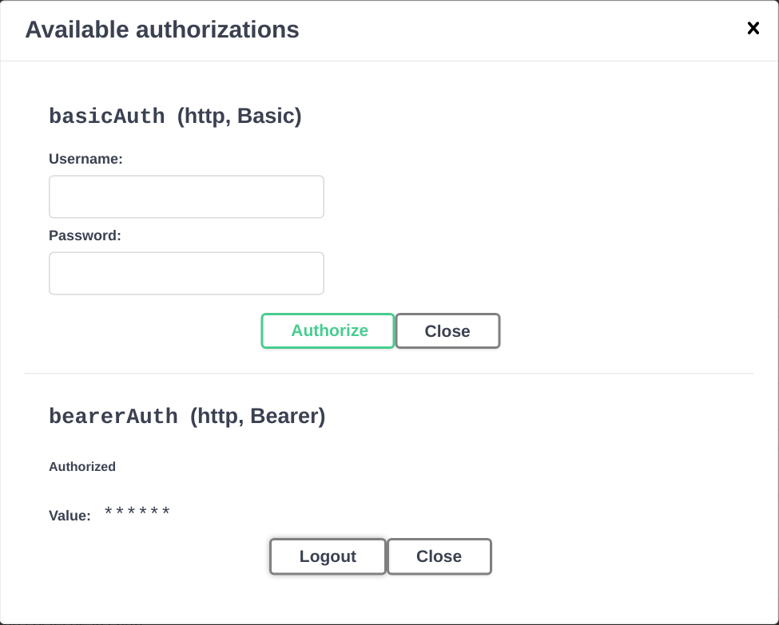

**Petición sin token (401)**

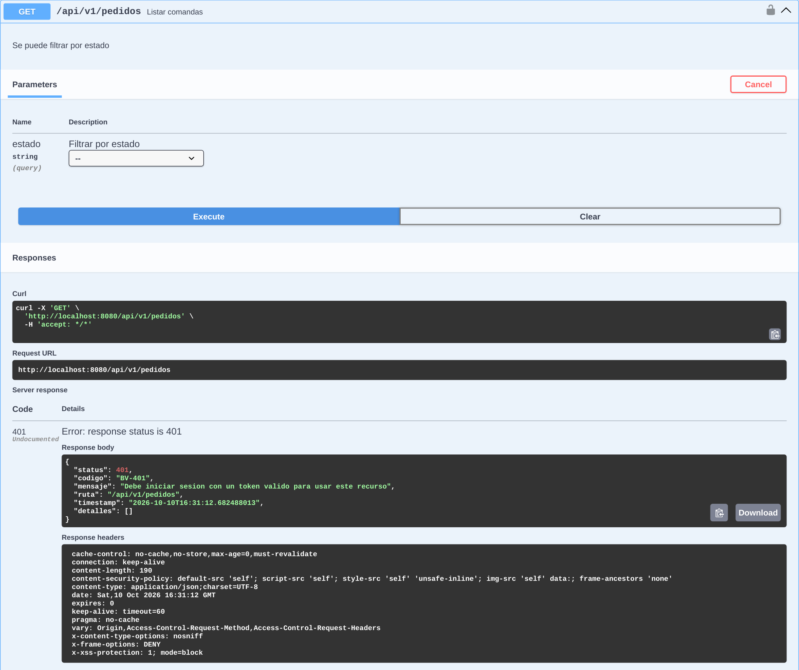

**Cliente intentando crear un cóctel (403)**

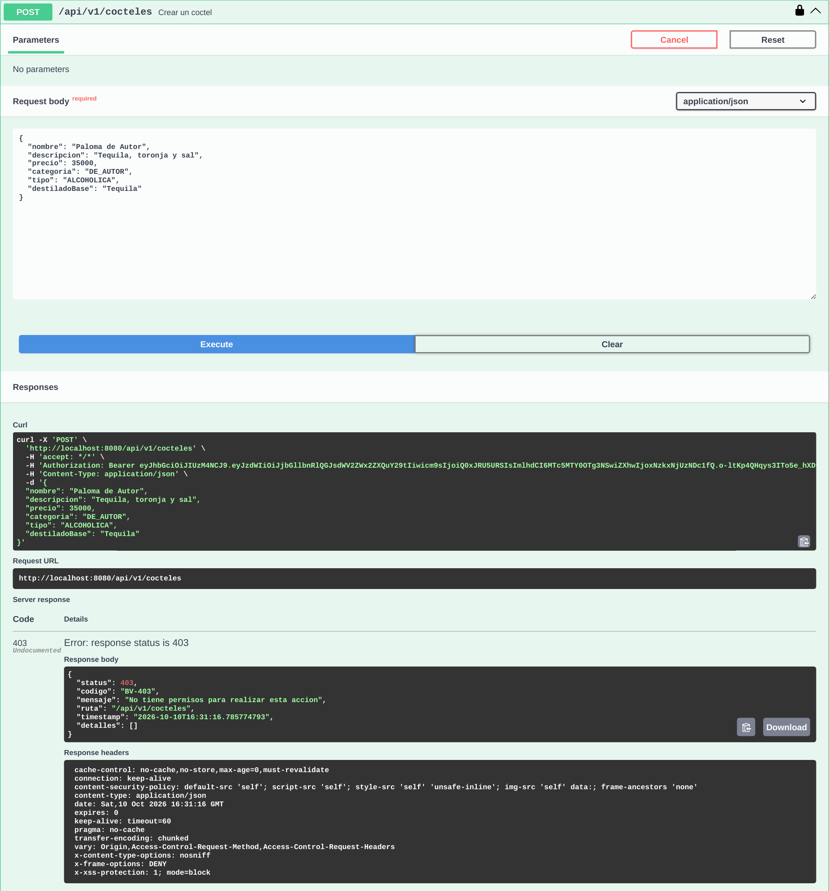

**Administrador creando un cóctel (201)**

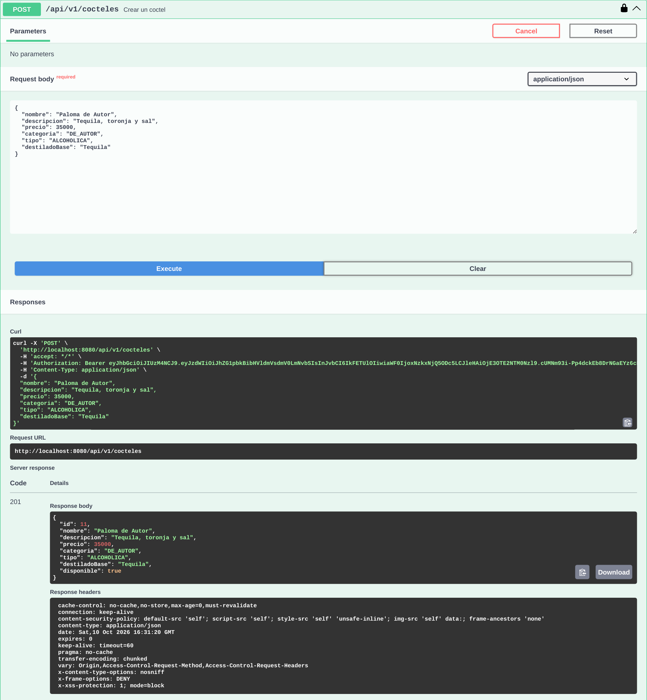

**Cabeceras de seguridad en la respuesta**

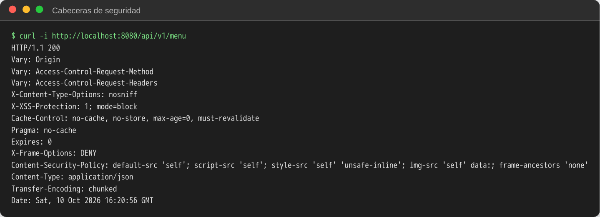

**Contraseñas cifradas con BCrypt en PostgreSQL**

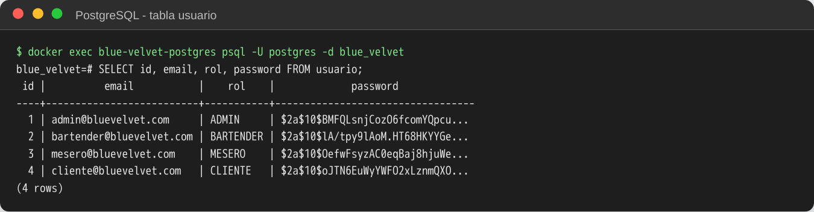

**Pruebas de seguridad en verde (`mvn test`)**

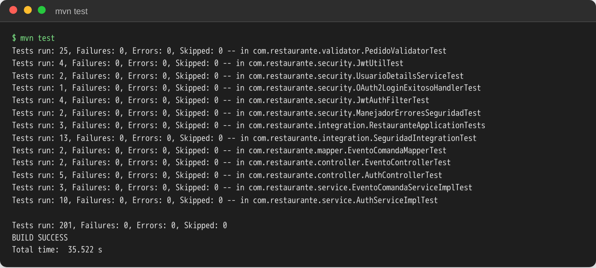

---

## Docker

La API se empaqueta con un `Dockerfile` multietapa: la primera etapa compila el proyecto con Maven y la segunda solo copia el JAR sobre una imagen ligera de Java (`eclipse-temurin:21-jre-alpine`), que corre con un usuario sin privilegios. `docker-compose.yml` levanta la API junto con PostgreSQL y MongoDB en una misma red, con volúmenes para conservar los datos y healthchecks para que la API arranque cuando las bases de datos estén listas.

Para levantar el stack se copia `.env.example` como `.env`, se completan los valores y se ejecuta:

```bash
docker compose up --build -d
```

### Variables de entorno

Las credenciales no están en el código. Se definen en un archivo `.env` (que no se sube al repositorio); `.env.example` tiene los nombres de las variables sin valores.

| Variable | Descripción |
|---|---|
| `DB_PASSWORD` | Contraseña de PostgreSQL |
| `MONGO_USERNAME` | Usuario administrador de MongoDB |
| `MONGO_PASSWORD` | Contraseña de MongoDB |
| `MONGO_URI` | Cadena de conexión a MongoDB cuando la API se ejecuta fuera de Docker |
| `JWT_SECRET` | Clave en Base64 para firmar los tokens (mínimo 256 bits) |
| `USUARIOS_PASSWORD` | Contraseña de los usuarios iniciales de cada rol |
| `SSL_KEYSTORE_PASSWORD` | Contraseña del certificado para el perfil `ssl` |
| `GOOGLE_CLIENT_ID` | Client ID de Google para el perfil `oauth2` |
| `GOOGLE_CLIENT_SECRET` | Client Secret de Google para el perfil `oauth2` |

### Imagen en Docker Hub

La imagen está publicada en [hub.docker.com/r/juanamunoz/blue-velvet-api](https://hub.docker.com/r/juanamunoz/blue-velvet-api) para `linux/amd64` y `linux/arm64`.

| Tag | Origen |
|---|---|
| `1.0`, `1.0.0` y `latest` | Versión de producción |
| `qa-latest` y `qa-<sha>` | Generadas por el pipeline de QA en cada push a `master` |

### Evidencias de Docker

**Servicios en ejecución (`docker compose ps`)**

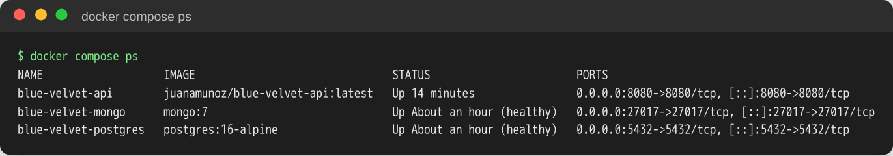

**Logs de la API con la conexión a las bases de datos**

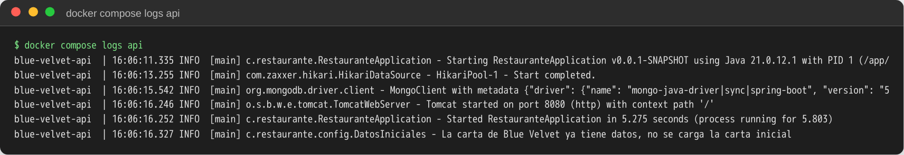

**Swagger funcionando en el contenedor**

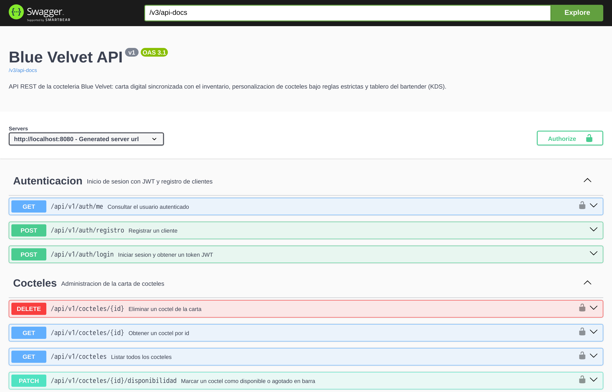

**Imagen publicada en Docker Hub**

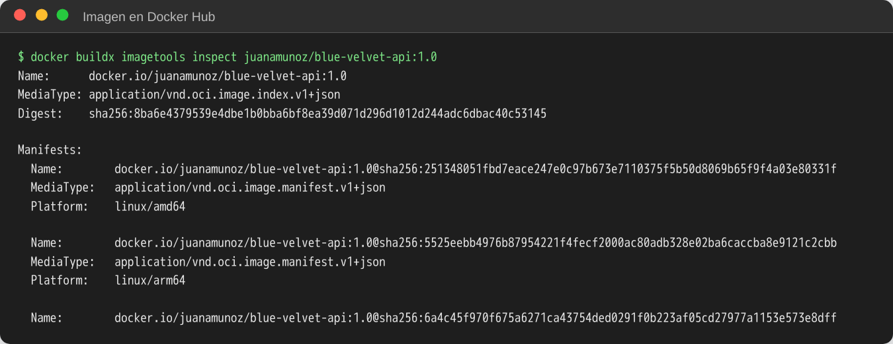

---

## CI/CD y despliegue

### Ambientes

| Ambiente | Cuándo se despliega | Propósito | Aprobación |
|---|---|---|---|
| QA | En cada push a `master` o `develop` | Validar que el código funciona después de cada cambio | Automática |
| PROD | Al crear un tag de versión `v*.*.*` | API estable para los usuarios | Manual en GitHub (ambiente `production`) |

| Ambiente | URL |
|---|---|
| QA | https://blue-velvet-qa-jnam.azurewebsites.net/swagger-ui/index.html |
| PROD | https://blue-velvet-prod-jnam.azurewebsites.net/swagger-ui/index.html |

Cada ambiente tiene su propio App Service, su propia base de datos PostgreSQL, su propia cuenta de MongoDB y sus propias credenciales, de modo que un problema en QA no afecta a producción.

### Pipelines

| Workflow | Jobs |
|---|---|
| `.github/workflows/ci-qa.yml` | **Pruebas**: ejecuta `mvn test` y publica el reporte de JaCoCo. **Build imagen Docker**: construye la imagen y la sube a Docker Hub con los tags `qa-latest` y `qa-<sha>`. **Desplegar a QA**: configura las variables de entorno del App Service de QA y despliega la imagen. En los pull requests solo se ejecutan las pruebas. |
| `.github/workflows/ci-prod.yml` | **Build imagen PROD**: ejecuta las pruebas y publica la imagen con la versión del tag y `latest`. **Desplegar a PROD**: espera la aprobación manual, configura las variables del App Service de producción y despliega la versión. **Resumen**: muestra la versión y la URL desplegadas. |

### Secrets configurados en GitHub

| Secret | Uso |
|---|---|
| `DOCKERHUB_USERNAME` | Usuario de Docker Hub |
| `DOCKERHUB_TOKEN` | Token de acceso de Docker Hub |
| `AZURE_CREDENTIALS` | Credenciales del Service Principal que despliega en Azure |
| `AZURE_RESOURCE_GROUP` | Grupo de recursos de Azure |
| `AZURE_WEBAPP_NAME_QA` / `AZURE_WEBAPP_NAME_PROD` | Nombre del App Service de cada ambiente |
| `DB_URL_QA` / `DB_URL_PROD` | URL de PostgreSQL de cada ambiente |
| `DB_USERNAME_QA` / `DB_USERNAME_PROD` | Usuario de PostgreSQL de cada ambiente |
| `DB_PASSWORD_QA` / `DB_PASSWORD_PROD` | Contraseña de PostgreSQL de cada ambiente |
| `MONGO_URI_QA` / `MONGO_URI_PROD` | Cadena de conexión de MongoDB de cada ambiente |
| `JWT_SECRET_QA` / `JWT_SECRET_PROD` | Clave de firma de los tokens de cada ambiente |
| `USUARIOS_PASSWORD_QA` / `USUARIOS_PASSWORD_PROD` | Contraseña de los usuarios iniciales de cada ambiente |

### Diagrama de despliegue

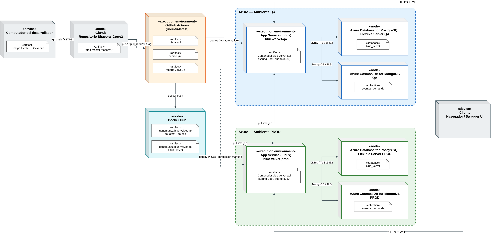

El diagrama se construyó en draw.io ([docs/diagramas/diagrama-despliegue.drawio](docs/diagramas/diagrama-despliegue.drawio)) y muestra cómo está desplegado el sistema:

- **Computador del desarrollador**: contiene el código fuente y el `Dockerfile`. Envía los cambios a GitHub con `git push` por HTTPS.
- **GitHub**: guarda el repositorio. Un push a `master` o un tag de versión dispara los workflows.
- **GitHub Actions**: ejecuta `ci-qa.yml` y `ci-prod.yml` en una máquina Ubuntu. Corre las pruebas, genera el reporte de JaCoCo, construye la imagen y la publica en Docker Hub.
- **Docker Hub**: guarda las imágenes `juanamunoz/blue-velvet-api` con los tags de QA y de producción. Es el nodo intermedio desde el que los App Service descargan la imagen.
- **Azure QA y Azure PROD**: cada ambiente tiene un App Service Linux que ejecuta el contenedor de la API en el puerto 8080, un servidor de Azure Database for PostgreSQL con la base `blue_velvet` y una cuenta de Azure Cosmos DB for MongoDB con la colección `eventos_comanda`. La API se conecta a PostgreSQL por JDBC y a MongoDB con el protocolo de MongoDB, ambos con TLS.
- **Cliente**: usa la API desde el navegador o Swagger UI por HTTPS, enviando el token JWT.

El despliegue a QA es automático (línea sólida) y el de producción requiere aprobación manual (línea punteada).

### Evidencias de CI/CD

**Pipeline de QA en verde (pruebas, imagen y despliegue)**

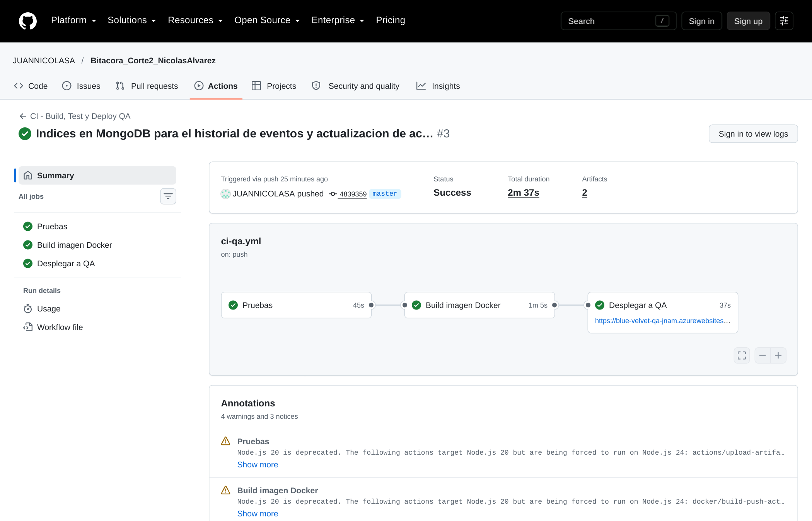

**API desplegada en Azure QA**

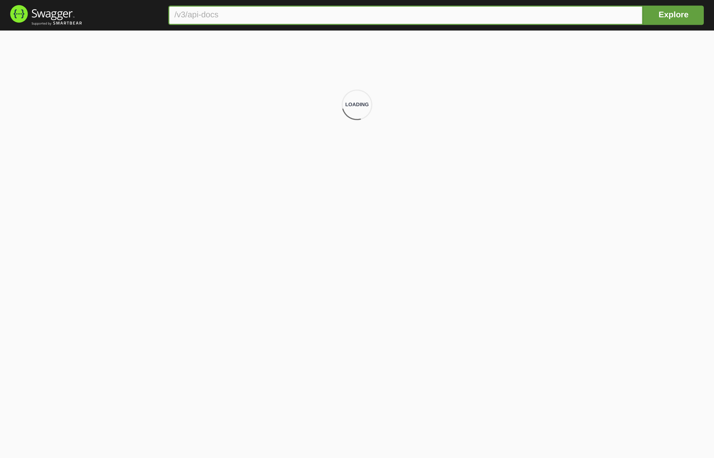

---

## Funcionalidades

| Funcionalidad | Descripción |
|---|---|
| Autenticación | Iniciar sesión con JWT, HTTP Basic u OAuth2 y registrar clientes. |
| Gestión de cócteles | Crear, actualizar, consultar, eliminar y cambiar la disponibilidad de los cócteles. |
| Carta digital | Consultar la carta y ver cuáles productos están disponibles o agotados. |
| Modificadores | Consultar y administrar los modificadores de los cócteles. |
| Comandas | Crear pedidos indicando la mesa y los cócteles solicitados. |
| Tablero de la barra | Consultar las comandas activas y cambiar su estado. |
| Cambio de licor | Permitir un solo cambio de destilado antes de la preparación. |
| Historial de eventos | Consultar en MongoDB lo que ha pasado con cada comanda. |

---

## Endpoints

Todas las rutas comienzan con `/api/v1/`. Los permisos de cada una están en [Permisos por endpoint](#permisos-por-endpoint).

### Autenticación

| Endpoint | Método | Función |
|---|---|---|
| `/api/v1/auth/login` | POST | Iniciar sesión y obtener el token |
| `/api/v1/auth/registro` | POST | Registrar un cliente |
| `/api/v1/auth/me` | GET | Consultar el usuario autenticado |

### Cócteles

| Endpoint | Método | Función |
|---|---|---|
| `/api/v1/cocteles` | GET | Consultar cócteles |
| `/api/v1/cocteles/{id}` | GET | Consultar un cóctel |
| `/api/v1/cocteles` | POST | Crear un cóctel |
| `/api/v1/cocteles/{id}` | PUT | Actualizar un cóctel |
| `/api/v1/cocteles/{id}/disponibilidad` | PATCH | Cambiar disponibilidad |
| `/api/v1/cocteles/{id}` | DELETE | Eliminar un cóctel |

### Menú

| Endpoint | Método | Función |
|---|---|---|
| `/api/v1/menu` | GET | Consultar la carta |
| `/api/v1/menu/disponibles` | GET | Consultar solo los disponibles |
| `/api/v1/menu/{id}` | GET | Consultar el detalle de un cóctel |
| `/api/v1/menu/{id}/modificadores` | GET | Consultar sus modificadores |

### Modificadores

| Endpoint | Método | Función |
|---|---|---|
| `/api/v1/modificadores` | GET | Consultar modificadores |
| `/api/v1/modificadores/{id}` | GET | Consultar un modificador |
| `/api/v1/modificadores` | POST | Crear un modificador |
| `/api/v1/modificadores/{id}/disponibilidad` | PATCH | Cambiar disponibilidad |

### Pedidos

| Endpoint | Método | Función |
|---|---|---|
| `/api/v1/pedidos` | POST | Crear una comanda |
| `/api/v1/pedidos` | GET | Consultar comandas |
| `/api/v1/pedidos/activos` | GET | Consultar las comandas activas |
| `/api/v1/pedidos/{id}` | GET | Consultar una comanda |
| `/api/v1/pedidos/{id}/estado` | PATCH | Cambiar el estado de una comanda |
| `/api/v1/pedidos/{id}/items/{idItem}/destilado` | PATCH | Cambiar el licor de un ítem |
| `/api/v1/pedidos/{id}` | DELETE | Cancelar una comanda |

### Eventos

| Endpoint | Método | Función |
|---|---|---|
| `/api/v1/eventos` | GET | Consultar el historial de eventos (filtro opcional `?idPedido=`) |

---

## Manejo de errores

Los errores se devuelven con un formato común.

```json
{
  "status": 422,
  "codigo": "BV-422",
  "mensaje": "El coctel Negroni requiere especificar la marca o tipo exacto de destilado",
  "ruta": "/api/v1/pedidos",
  "timestamp": "2026-09-22T21:15:03.120",
  "detalles": []
}
```

| Código | Uso |
|---|---|
| 400 `BV-400` | Datos de entrada incorrectos |
| 401 `BV-401` | Sin token, token inválido o vencido, o credenciales incorrectas |
| 403 `BV-403` | El rol no tiene permiso o la comanda pertenece a otro cliente |
| 404 `BV-404` | Recurso no encontrado |
| 405 `BV-405` | Método no permitido |
| 409 `BV-409` | Nombre o correo duplicado, o cóctel con comandas registradas |
| 422 `BV-422` | Regla de negocio no cumplida |
| 429 `BV-429` | Demasiados intentos de login fallidos |
| 500 `BV-500` | Error inesperado |

---

## Pruebas

Se ejecutan 201 pruebas, con una cobertura de JaCoCo del 99 % en instrucciones y del 93 % en ramas.

| Parte | Pruebas |
|---|---|
| Servicios | Creación, actualización, eliminación, búsquedas, reglas de pedidos, login, registro, bloqueo por intentos y registro de eventos |
| Validadores | Alcohol, Mocktails, cambio de licor, estados y dueño de la comanda |
| Seguridad | Generación y validación de JWT, filtro JWT, carga de usuarios, respuestas 401 y 403 y login con OAuth2 |
| Utilidades | Normalización de nombres y etiquetas |
| Mappers | Conversión entre DTOs, dominio, entidades y documentos |
| Repositorios | Consultas a la base de datos con H2 |
| Dominio | Totales, subtotales y estados |
| Controladores | Respuestas HTTP y errores |
| Integración | Flujo completo de una comanda con roles, CRUD de un cóctel y verificación de seguridad: login, 401 sin token, token inválido y vencido, 403 por rol, HTTP Basic, cabeceras, registro con contraseña cifrada y CORS |

---

## Evidencias

### Swagger

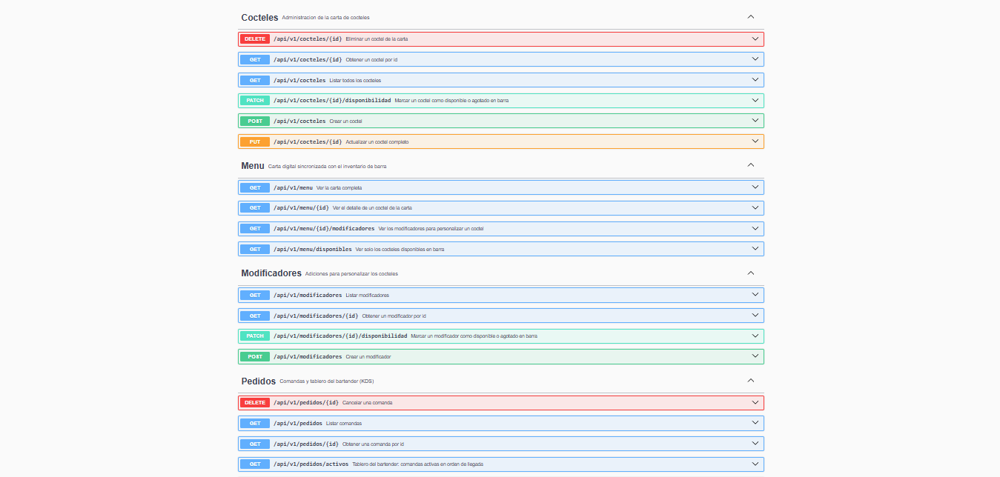

### Ejecución de la aplicación

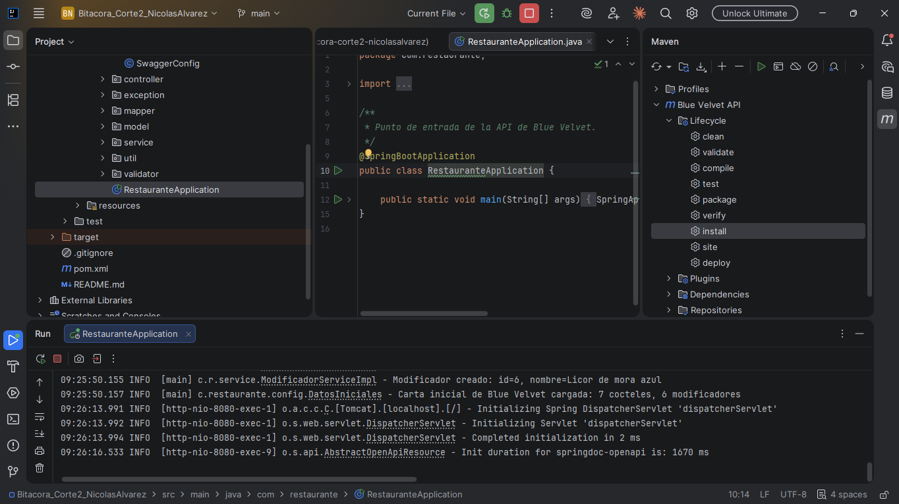

### Pruebas y cobertura

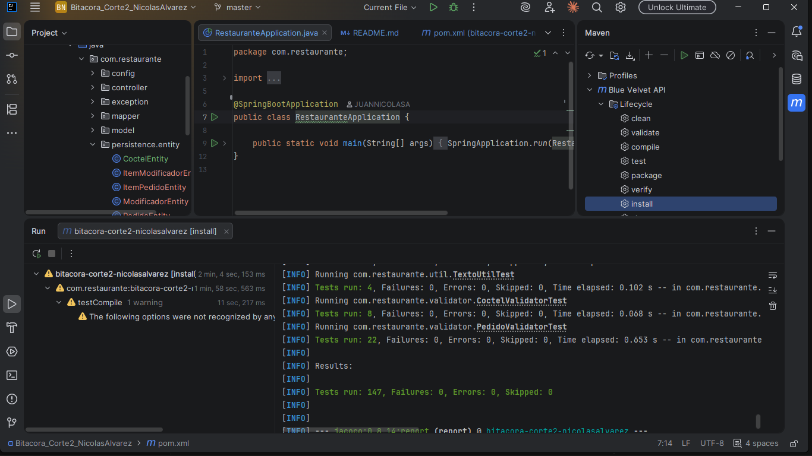

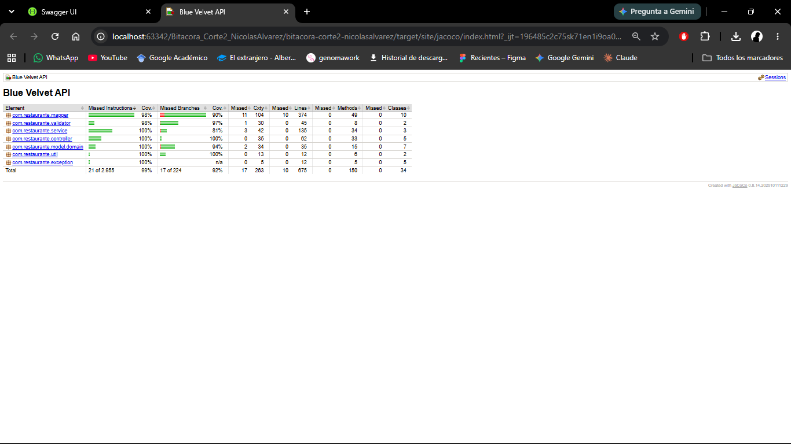

### SonarQube

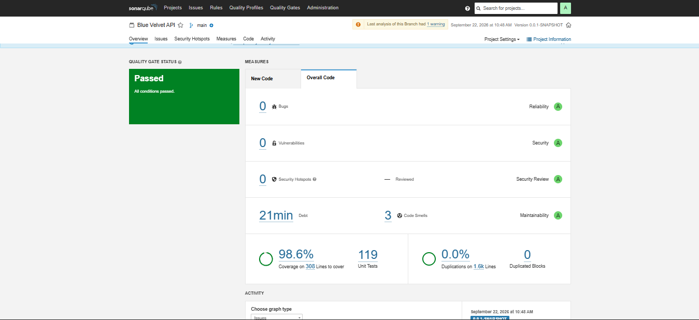

### Persistencia en PostgreSQL

Se probó el CRUD de un cóctel desde Swagger y se revisó el resultado directamente en la base de datos.

**Tablas creadas por Hibernate en PostgreSQL**

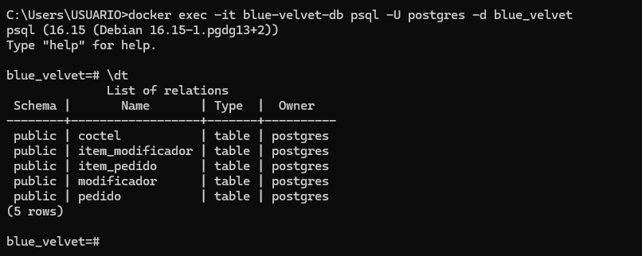

**Crear un cóctel (201)**

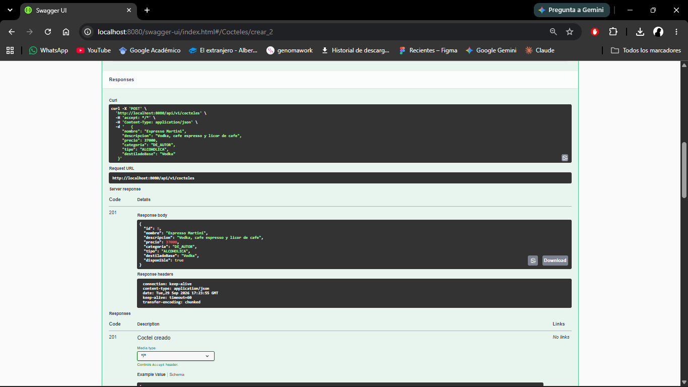

**Consultar el cóctel creado (200)**

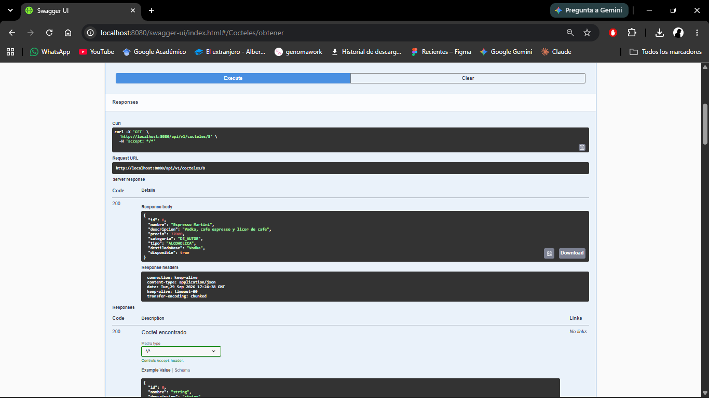

**Registro guardado en la tabla `coctel`**

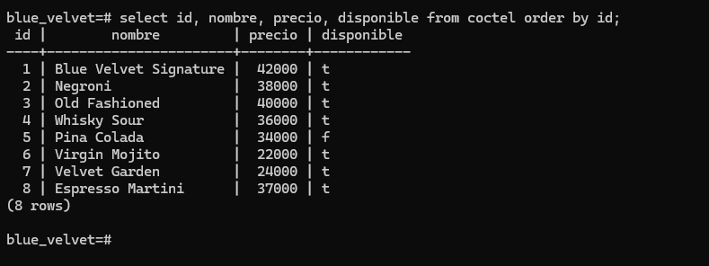

**Eliminar el cóctel (204)**

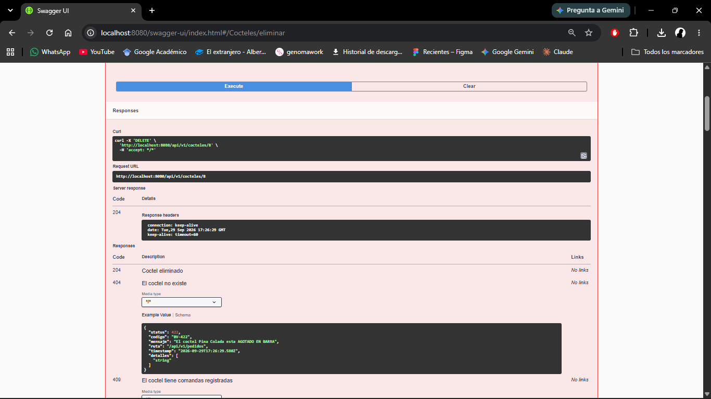

**Los datos se conservan al reiniciar la aplicación**

Al volver a iniciar, la aplicación detecta que la base ya tiene información y no vuelve a cargar la carta inicial. La consulta de cócteles devuelve los mismos registros.

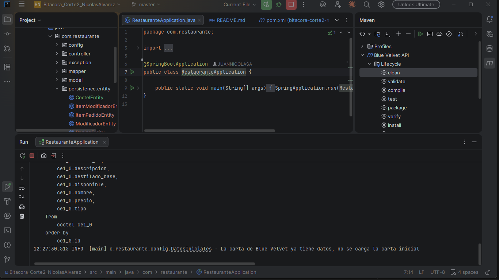

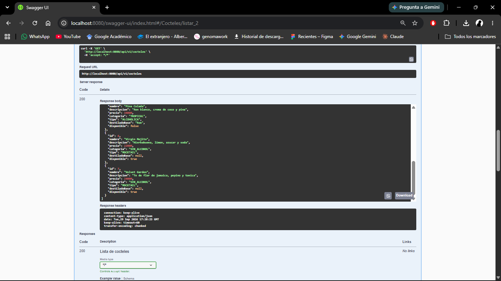

### Persistencia en MongoDB

Al crear una comanda y cambiar su estado, los eventos quedan guardados en la colección `eventos_comanda`.

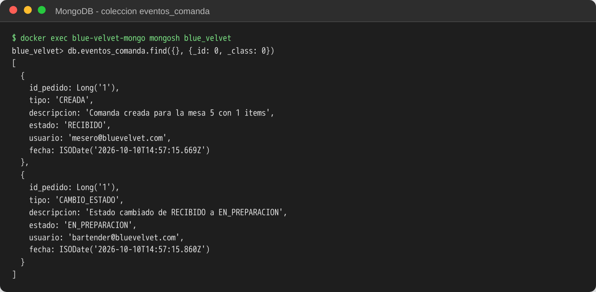

### Pruebas funcionales

| Funcionalidad | Evidencia |
|---|---|
| Crear cóctel |  |
| Carta con productos agotados | 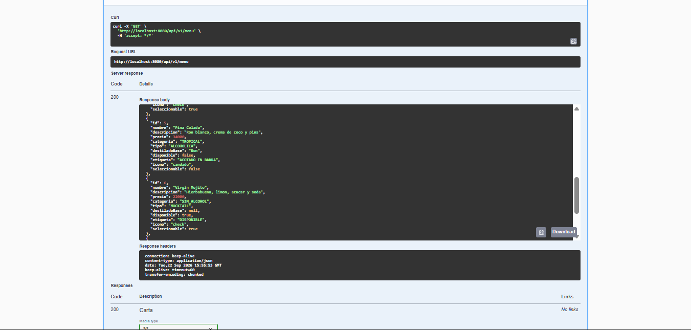 |
| Modificadores bloqueados en Mocktail | 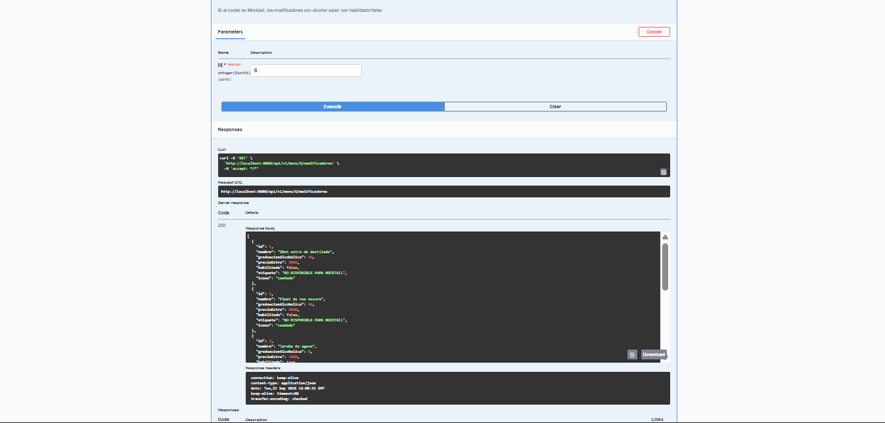 |
| Crear comanda | 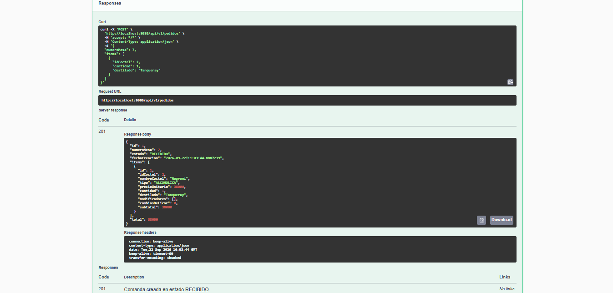 |
| Trazabilidad del alcohol | 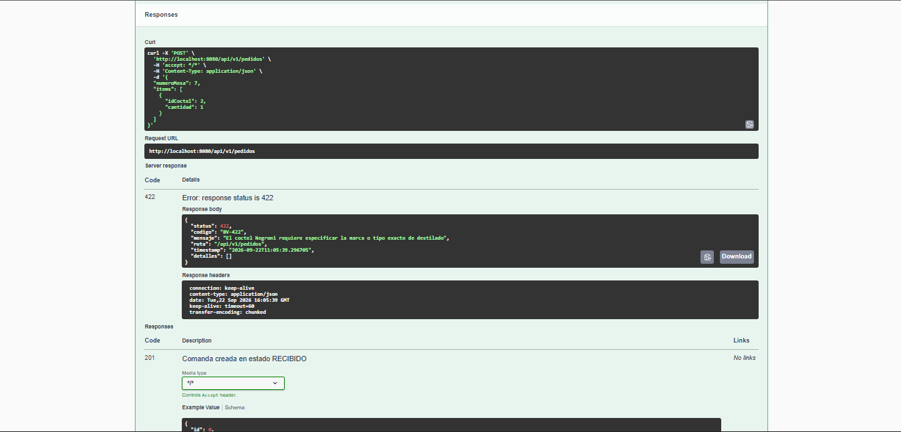 |
| Cambio de estado en el KDS | 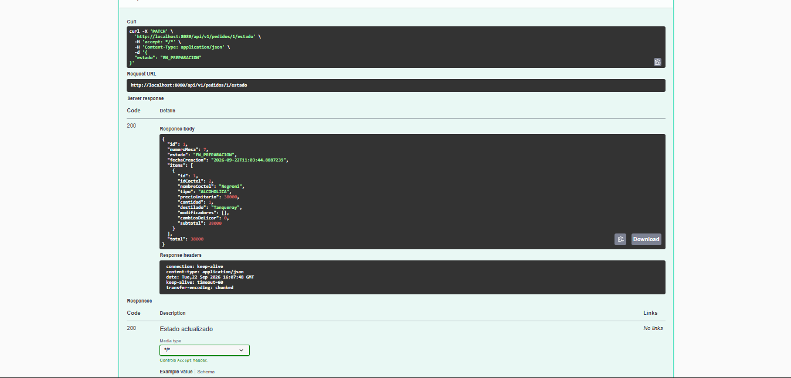 |
| Cambio de licor una sola vez | 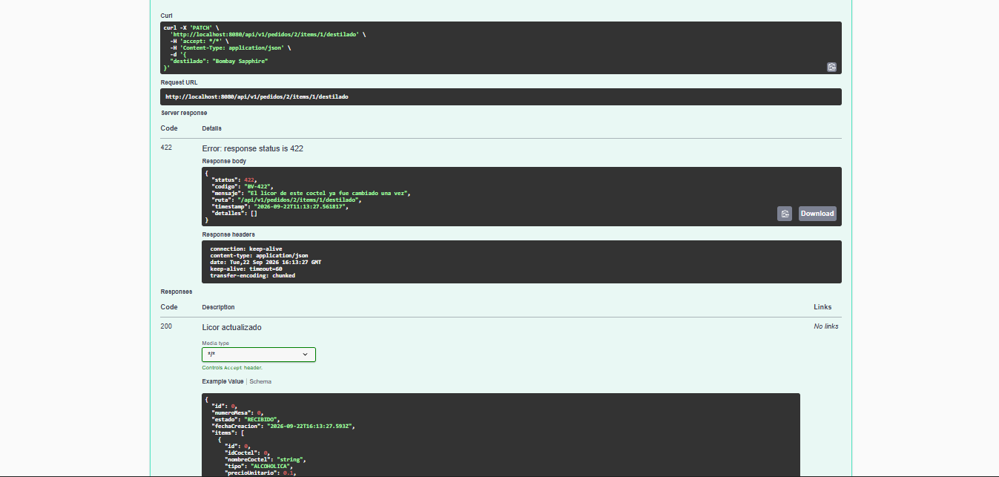 |
| Validación del precio | 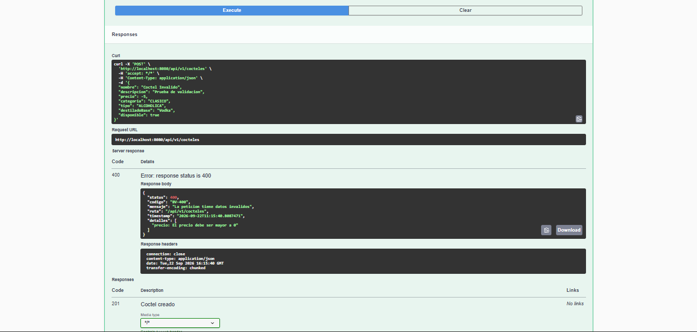 |

---

## Fuera de alcance

- Pagos y facturación electrónica.
- Interfaz gráfica.
- Orquestación con Kubernetes.
